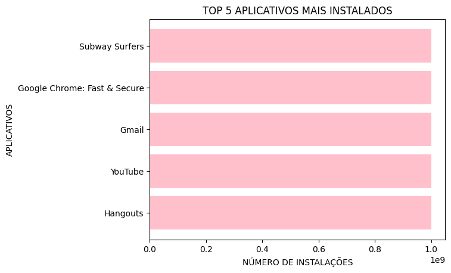
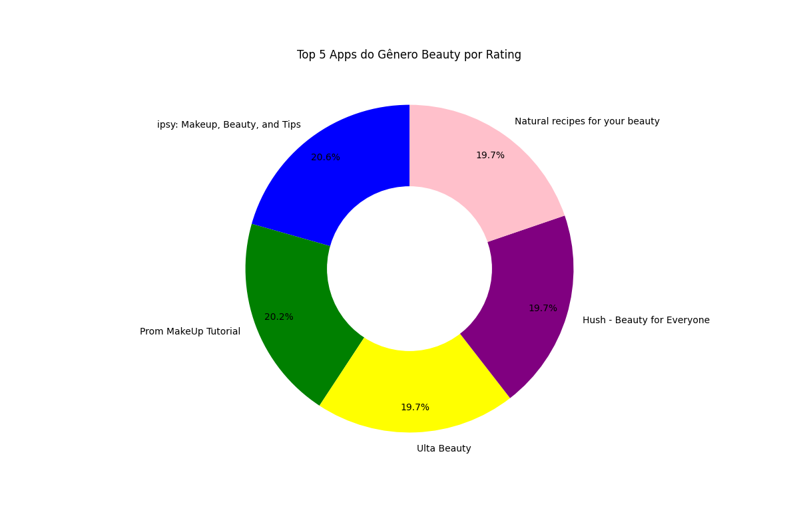
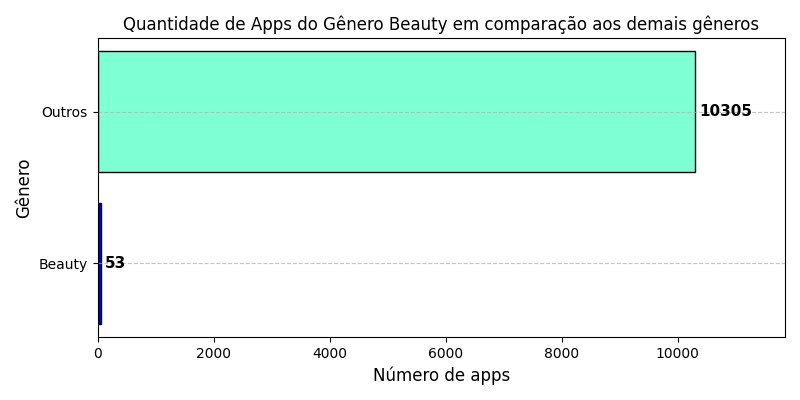

# DESAFIO

O objetivo deste desafio foi analisar o dataset googleplaystore.csv, que contém estatísticas da loja de aplicativos do Google. A proposta era praticar a utilização das bibliotecas Pandas e Matplotlib para realizar a limpeza, transformação e visualização de dados gerando gráficos.


## ETAPA 1

A primeira etapa do desafio foi basicamente preparar o ambiente. Sendo assim, instalei as extensões Python e Jupyter no VSCode.

Ademais, instalei o Jupyter no ambiente Python, através do comando "pip install jupyter" no terminal e, após isso, instalei a biblioteca Pandas e e Matplotlib pelos comandos "pip install pandas" e "pip install matplotlib".

Por último, abri um **notebook** (`desafio.ipynb`), li o arquivo csv e o transformei em um dataFrame.

````py
df = pd.read_csv('googleplaystore.csv')
````

## ETAPA 2

A segunda etapa foi realizada seguindo [esses passos](https://github.com/aline-hoffmann/scholarship-compass/blob/main/Sprint_2/Desafio/desafio.ipynb) e alguns itens resultaram em gráficos, sendo eles:

### Item 2 - Gráfico de barras com os top 5 apps por número de instalação.




### Item 3 - Gráfico de pizza com as categorias de apps existentes no dataset de acordo com a frequência em que elas aparecem.


### Item 8 - Gráfico "donut" com os top 5 apps do gênero beauty.



### - Gráfico mostrando o número de aplicativos com o gênero beauty em comparação com os demais gêneros.

