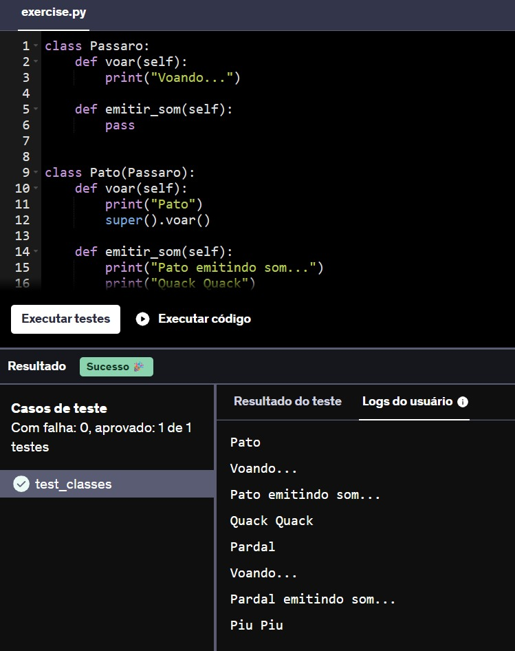
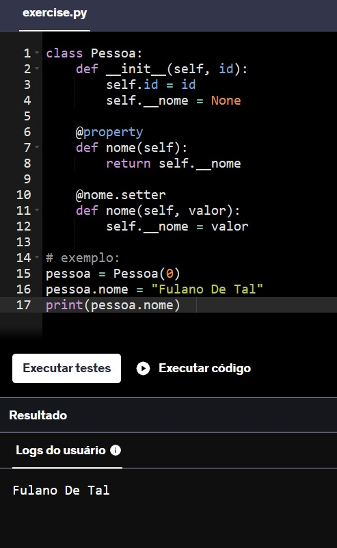
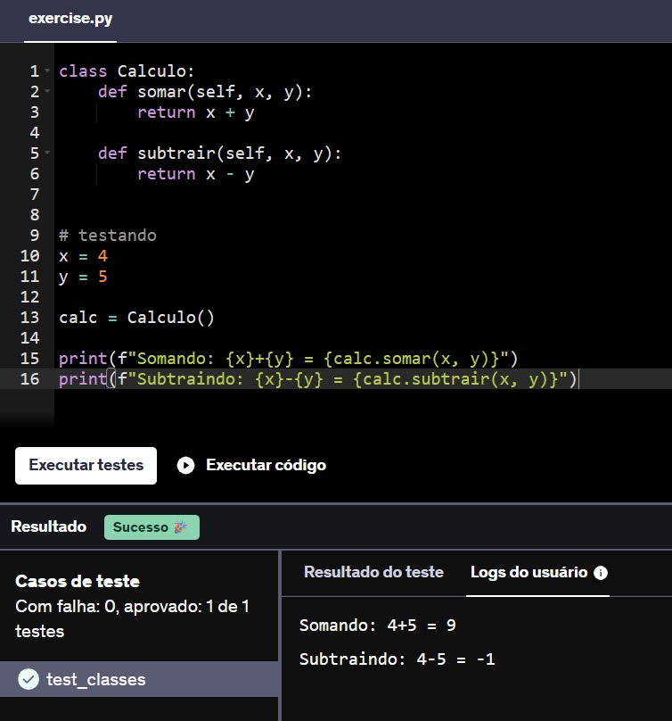
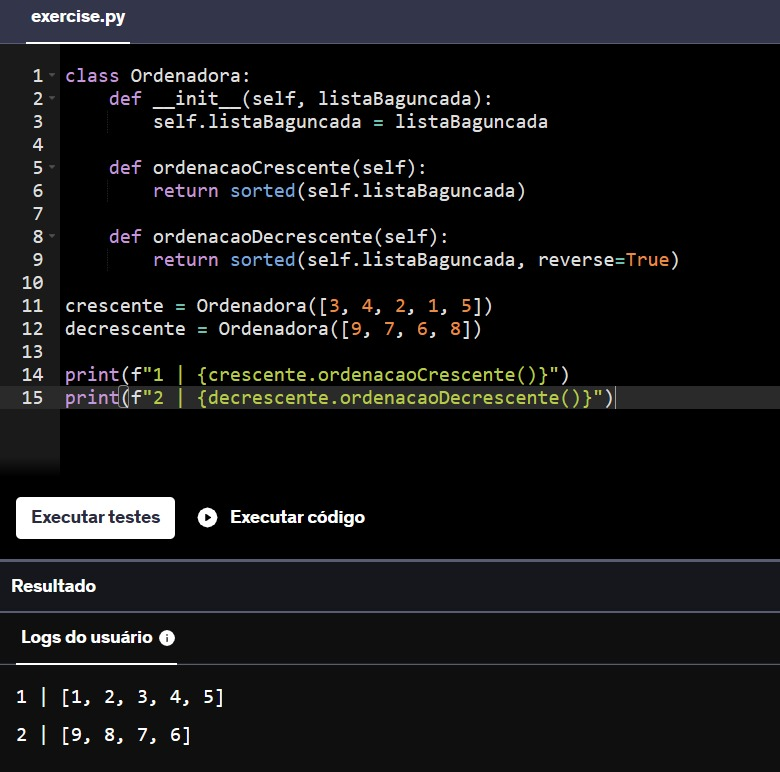
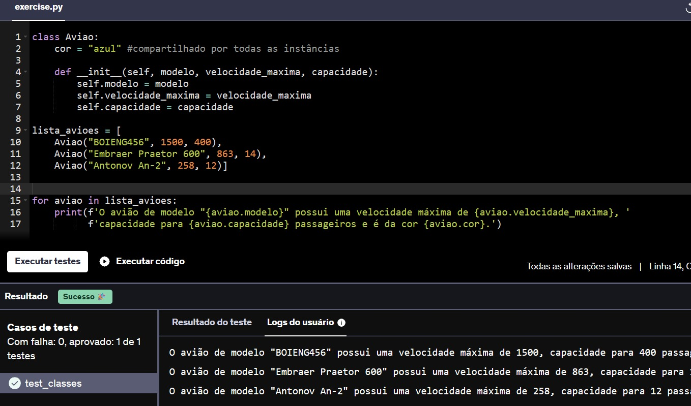

## <p align="center"> EXERCÍCIOS - PARTE 2</p>

**15.** Implemente duas classes, Pato e Pardal , que herdam de uma superclasse chamada Passaro as habilidades de voar e emitir som.

Contudo, tanto Pato quanto Pardal devem emitir sons diferentes (de maneira escrita) no console, conforme o modelo a seguir.

Imprima no console exatamente assim:

Pato
Voando...
Pato emitindo som...
Quack Quack
Pardal
Voando...
Pardal emitindo som...
Piu Piu

````py
class Passaro:
    def voar(self):
        print("Voando...")
    
    def emitir_som(self):
        pass


class Pato(Passaro):
    def voar(self):
        print("Pato")
        super().voar()
    
    def emitir_som(self):
        print("Pato emitindo som...")
        print("Quack Quack")


class Pardal(Passaro):
    def voar(self):
        print("Pardal")
        super().voar()
    
    def emitir_som(self):
        print("Pardal emitindo som...")
        print("Piu Piu")


pato = Pato()
pato.voar()
pato.emitir_som()

pardal = Pardal()
pardal.voar()
pardal.emitir_som()
````



**16.** Crie uma classe chamada Pessoa, com um atributo privado chamado nome (declarado internamente na classe como __nome) e um atributo público de nome id.

Adicione dois métodos à classe, sendo um para definir o valor de __nome e outro para retornar o valor do respectivo atributo.

Lembre-se que o acesso ao atributo privado deve ocorrer somente através dos métodos definidos, nunca diretamente.  Você pode alcançar este comportamento através do recurso de properties do Python.

````py
class Pessoa:
    def __init__(self, id):
        self.id = id
        self.__nome = None 

    @property
    def nome(self):
        return self.__nome

    @nome.setter
    def nome(self, valor):
        self.__nome = valor
````



**17.** Crie uma classe  Calculo  que contenha um método que aceita dois parâmetros, X e Y, e retorne a soma dos dois. Nessa mesma classe, implemente um método de subtração, que aceita dois parâmetros, X e Y, e retorne a subtração dos dois (resultados negativos são permitidos).

Utilize os valores abaixo para testar seu exercício:

x = 4 
y = 5
imprima:

Somando: 4+5 = 9
Subtraindo: 4-5 = -1

````py
class Calculo:
    def somar(self, x, y):
        return x + y
    
    def subtrair(self, x, y):
        return x - y


# testando
x = 4
y = 5

calc = Calculo()

print(f"Somando: {x}+{y} = {calc.somar(x, y)}")
print(f"Subtraindo: {x}-{y} = {calc.subtrair(x, y)}")
````



**18.** Crie uma classe Ordenadora que contenha um atributo listaBaguncada e que contenha os métodos ordenacaoCrescente e ordenacaoDecrescente.

Instancie um objeto chamado crescente dessa classe Ordenadora que tenha como listaBaguncada a lista [3,4,2,1,5] e instancie um outro objeto, decrescente dessa mesma classe com uma outra listaBaguncada sendo [9,7,6,8].

Para o primeiro objeto citado, use o método ordenacaoCrescente e para o segundo objeto, use o método ordenacaoDecrescente.

Imprima o resultado da ordenação crescente e da ordenação decresce

1 | [1, 2, 3, 4, 5] <br>
2 | [9, 8, 7, 6]

````py
class Ordenadora:
    def __init__(self, listaBaguncada):
        self.listaBaguncada = listaBaguncada
    
    def ordenacaoCrescente(self):
        return sorted(self.listaBaguncada)

    def ordenacaoDecrescente(self):
        return sorted(self.listaBaguncada, reverse=True)
    
crescente = Ordenadora([3, 4, 2, 1, 5])
decrescente = Ordenadora([9, 7, 6, 8])

print(f"1 | {crescente.ordenacaoCrescente()}")
print(f"2 | {decrescente.ordenacaoDecrescente()}")
````



**19.** Crie uma classe Avião que possua os atributos modelo, velocidade_maxima, cor e capacidade.

Defina o atributo cor de sua classe , de maneira que todas as instâncias de sua classe avião sejam da cor “azul”.

Após isso, a partir de entradas abaixo, instancie e armazene em uma lista 3 objetos da classe Avião.

Ao final, itere pela lista imprimindo cada um dos objetos no seguinte formato:

“O avião de modelo “x” possui uma velocidade máxima de “y”, capacidade para “z” passageiros e é da cor “w”.

Sendo x, y, z e w cada um dos atributos da classe “Avião”.

Valores de entrada:

modelo BOIENG456: velocidade máxima 1500 km/h: capacidade para 400 passageiros: Cor Azul

modelo Embraer Praetor 600: velocidade máxima 863km/h: capacidade para 14 passageiros: Cor Azul

modelo Antonov An-2: velocidade máxima de 258 Km/h: capacidade para 12 passageiros: Cor Azul

````py
#Tentei criar a classe "Avião", porém nos testes da Udemy não reconhecia. Então tirei o acento.
class Aviao:
    cor = "azul" #compartilhado por todas as instâncias

    def __init__(self, modelo, velocidade_maxima, capacidade):
        self.modelo = modelo
        self.velocidade_maxima = velocidade_maxima
        self.capacidade = capacidade

lista_avioes = [
    Aviao("BOIENG456", 1500, 400),
    Aviao("Embraer Praetor 600", 863, 14),
    Aviao("Antonov An-2", 258, 12)]


for aviao in lista_avioes:
    print(f'O avião de modelo "{aviao.modelo}" possui uma velocidade máxima de {aviao.velocidade_maxima}, '
          f'capacidade para {aviao.capacidade} passageiros e é da cor {aviao.cor}.')
````

