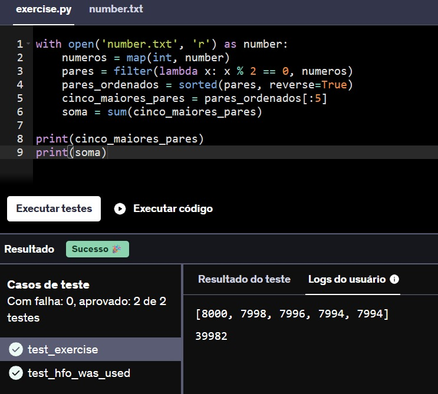
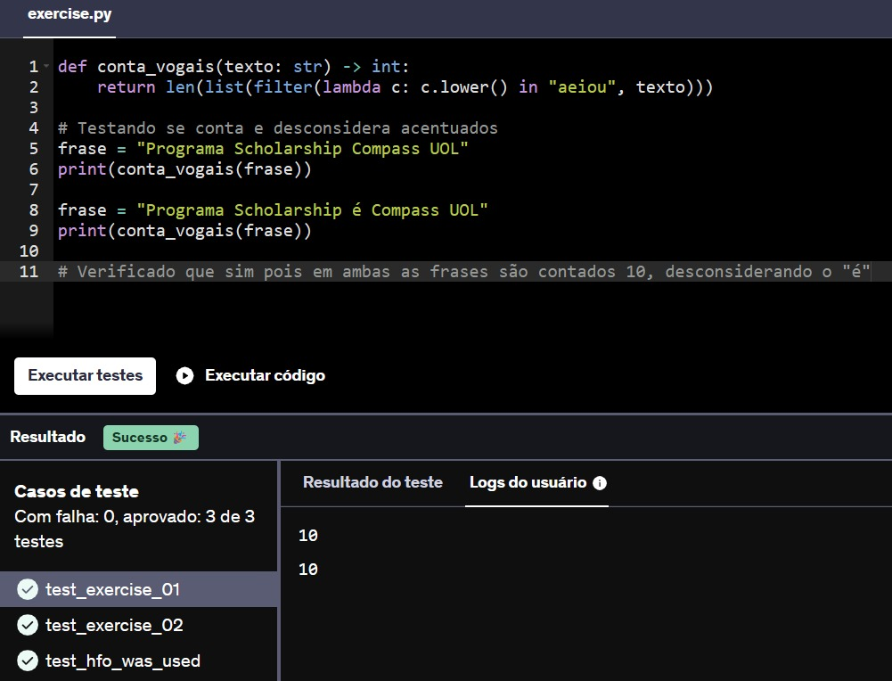
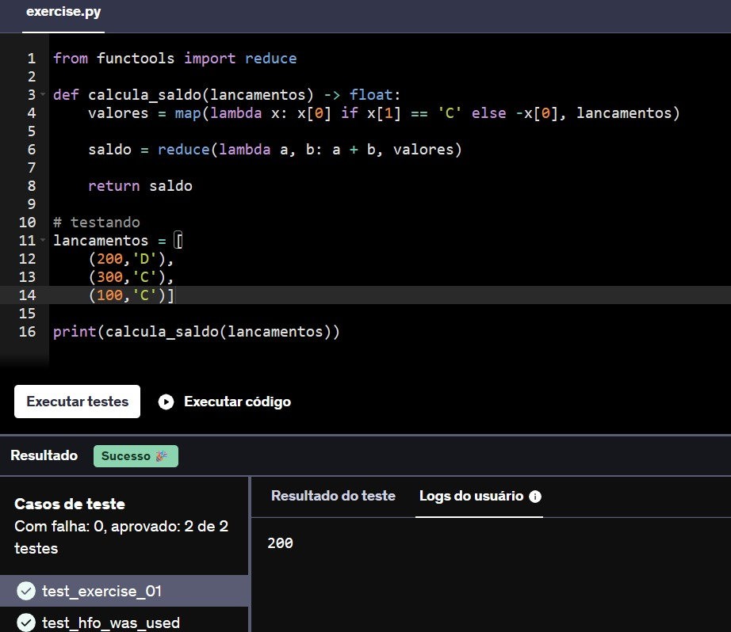
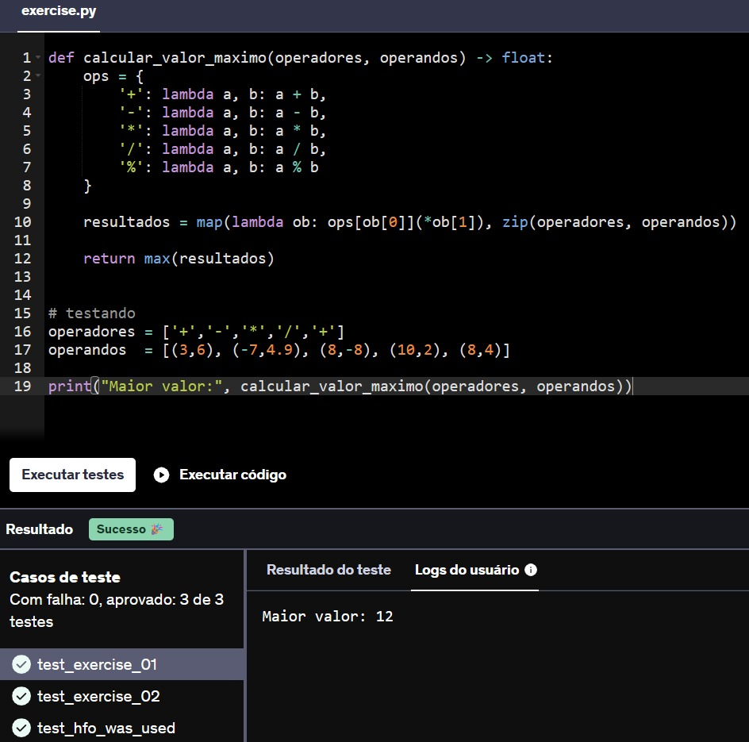
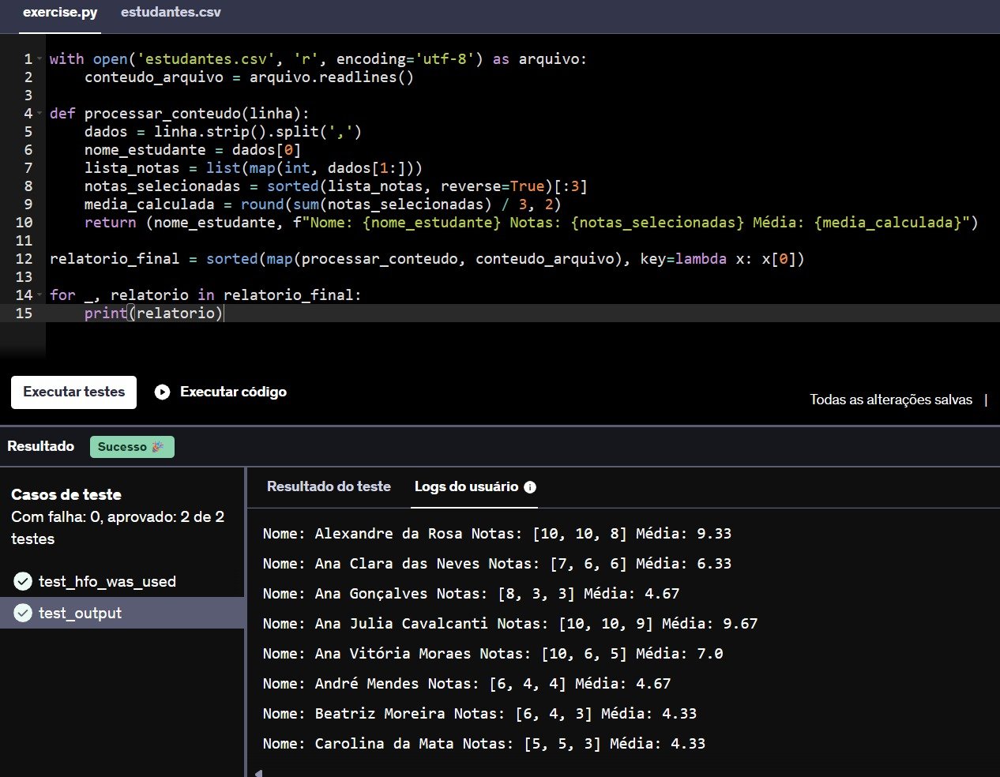
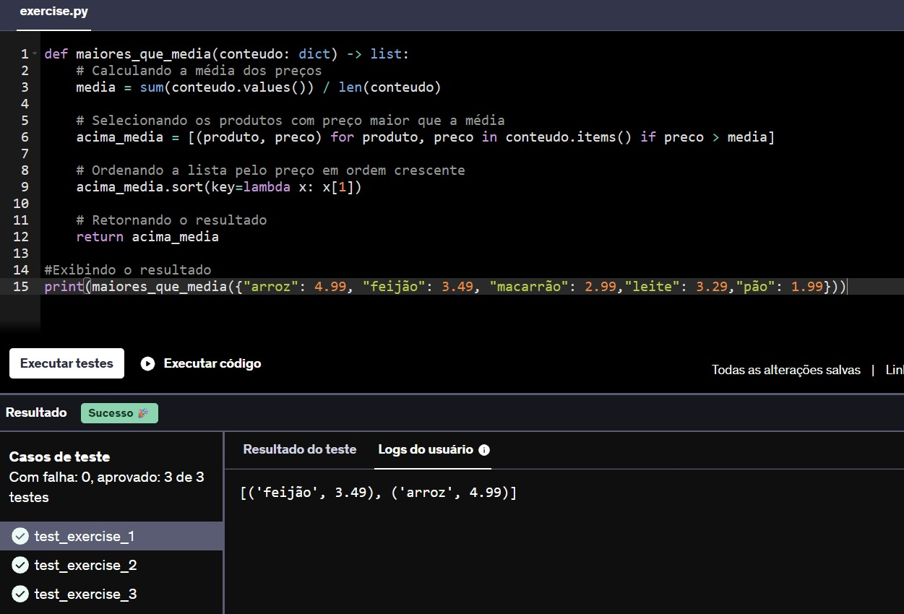
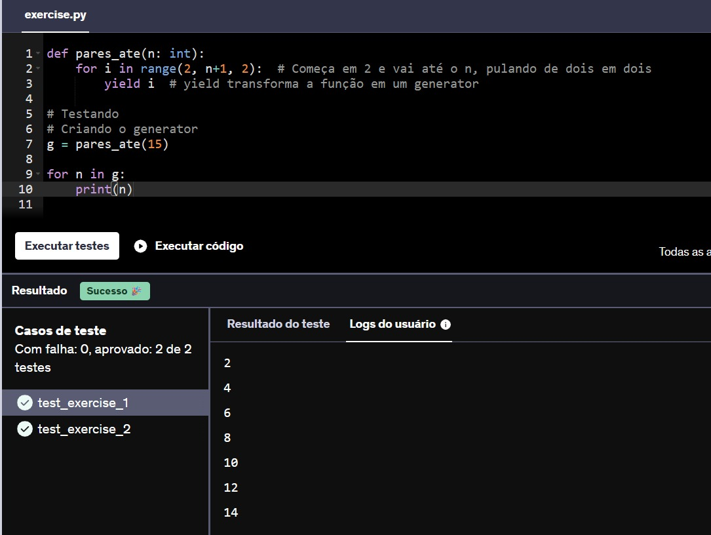

## <p align="center"> EXERCÍCIOS - PARTE 3</p>

**20.** Você está recebendo um arquivo contendo 10.000 números inteiros, um em cada linha. Utilizando lambdas e high order functions, apresente os 5 maiores valores pares e a soma destes.

Você deverá aplicar as seguintes funções no exercício:

map

filter

sorted

sum

Seu código deverá exibir na saída (simplesmente utilizando 2 comandos `print()`):

a lista dos 5 maiores números pares em ordem decrescente;

a soma destes valores.

````py
with open('number.txt', 'r') as number:
    numeros = map(int, number)                  
    pares = filter(lambda x: x % 2 == 0, numeros) 
    pares_ordenados = sorted(pares, reverse=True)  
    cinco_maiores_pares = pares_ordenados[:5]     
    soma = sum(cinco_maiores_pares)               

print(cinco_maiores_pares)
print(soma)
````



**21.** Utilizando high order functions, implemente o corpo da função conta_vogais. O parâmetro de entrada será uma string e o resultado deverá ser a contagem de vogais presentes em seu conteúdo.

É obrigatório aplicar as seguintes funções:

len

filter

lambda

Desconsidere os caracteres acentuados. Eles não serão utilizados nos testes do seu código.

````py
def conta_vogais(texto: str) -> int:
    return len(list(filter(lambda c: c.lower() in "aeiou", texto)))

# Testando se conta e desconsidera acentuados
frase = "Programa Scholarship Compass UOL"
print(conta_vogais(frase))

frase = "Programa Scholarship é Compass UOL"
print(conta_vogais(frase))

# Verificado que sim pois em ambas as frases são contados 10, desconsiderando o "é"
````



**22.** A função calcula_saldo recebe uma lista de tuplas, correspondendo a um conjunto de lançamentos bancários. Cada lançamento é composto pelo seu valor (sempre positivo) e pelo seu tipo (C - crédito ou D - débito). 

Abaixo apresentando uma possível entrada para a função.

lancamentos = [
    (200,'D'),
    (300,'C'),
    (100,'C')
]

A partir dos lançamentos, a função deve calcular o valor final, somando créditos e subtraindo débitos. Na lista anterior, por exemplo, teríamos como resultado final 200.

Além de utilizar lambdas, você deverá aplicar, obrigatoriamente, as seguintes funções na resolução:

reduce (módulo functools)

map

````py
from functools import reduce

def calcula_saldo(lancamentos) -> float:
    valores = map(lambda x: x[0] if x[1] == 'C' else -x[0], lancamentos)
    
    saldo = reduce(lambda a, b: a + b, valores)
    
    return saldo
    
# testando
lancamentos = [
    (200,'D'),
    (300,'C'),
    (100,'C')]

print(calcula_saldo(lancamentos))
````



**23.** A função calcular_valor_maximo deve receber dois parâmetros, chamados de operadores e operandos. Em operadores, espera-se uma lista de caracteres que representam as operações matemáticas suportadas (+, -, /, *, %), as quais devem ser aplicadas à lista de operadores nas respectivas posições. Após aplicar cada operação ao respectivo par de operandos, a função deverá retornar o maior valor dentre eles.

Na resolução da atividade você deverá aplicar as seguintes funções:

max<br>
zip<br>
map

````py
def calcular_valor_maximo(operadores, operandos) -> float:
    ops = {
        '+': lambda a, b: a + b,
        '-': lambda a, b: a - b,
        '*': lambda a, b: a * b,
        '/': lambda a, b: a / b,
        '%': lambda a, b: a % b
    }

    resultados = map(lambda ob: ops[ob[0]](*ob[1]), zip(operadores, operandos))

    return max(resultados)


# testando
operadores = ['+','-','*','/','+']
operandos  = [(3,6), (-7,4.9), (8,-8), (10,2), (8,4)]

print("Maior valor:", calcular_valor_maximo(operadores, operandos))
````



**24.** Um determinado sistema escolar exporta a grade de notas dos estudantes em formato CSV. Cada linha do arquivo corresponde ao nome do estudante, acompanhado de 5 notas de avaliação, no intervalo [0-10]. É o arquivo estudantes.csv de seu exercício.

Precisamos processar seu conteúdo, de modo a gerar como saída um relatório em formato textual contendo as seguintes informações:

Nome do estudante

Três maiores notas, em ordem decrescente

Média das três maiores notas, com duas casas decimais de precisão

O resultado do processamento deve ser escrito na saída padrão (print), ordenado pelo nome do estudante e obedecendo ao formato descrito a seguir:

Nome: <nome estudante> Notas: [n1, n2, n3] Média: <média>

Em seu desenvolvimento você deverá utilizar lambdas e as seguintes funções:

round<br>
map<br>
sorted

````
with open('estudantes.csv', 'r', encoding='utf-8') as arquivo:
    conteudo_arquivo = arquivo.readlines()

def processar_conteudo(linha):
    dados = linha.strip().split(',')
    nome_estudante = dados[0]
    lista_notas = list(map(int, dados[1:]))
    notas_selecionadas = sorted(lista_notas, reverse=True)[:3]
    media_calculada = round(sum(notas_selecionadas) / 3, 2)
    return (nome_estudante, f"Nome: {nome_estudante} Notas: {notas_selecionadas} Média: {media_calculada}")

relatorio_final = sorted(map(processar_conteudo, conteudo_arquivo), key=lambda x: x[0])

for _, relatorio in relatorio_final:
    print(relatorio)
````



**25.** Você foi encarregado de desenvolver uma nova feature  para um sistema de gestão de supermercados. O analista responsável descreveu o requisito funcional da seguinte forma:

Para realizar um cálculo de custo, o sistema deverá permitir filtrar um determinado conjunto de produtos, de modo que apenas aqueles cujo valor unitário for superior à média deverão estar presentes no resultado. 

````py
def maiores_que_media(conteudo: dict) -> list:
    # Calculando a média dos preços
    media = sum(conteudo.values()) / len(conteudo)

    # Selecionando os produtos com preço maior que a média
    acima_media = [(produto, preco) for produto, preco in conteudo.items() if preco > media]

    # Ordenando a lista pelo preço em ordem crescente
    acima_media.sort(key=lambda x: x[1])

    # Retornando o resultado
    return acima_media
    
#Exibindo o resultado
print(maiores_que_media({"arroz": 4.99, "feijão": 3.49, "macarrão": 2.99,"leite": 3.29,"pão": 1.99}))
````



**26.** Generators são poderosos recursos da linguagem Python. Neste exercício, você deverá criar o corpo de uma função, cuja assinatura já consta em seu arquivo de início (def pares_ate(n:int):) .

O objetivo da função pares_ate é retornar um generator para os valores pares no intervalo [2,n] . Observe que n representa o valor do parâmetro informado na chamada da função.

````py
def pares_ate(n: int):
    for i in range(2, n+1, 2):  # Começa em 2 e vai até o n, pulando de dois em dois
        yield i  # yield transforma a função em um generator
        
# Testando
# Criando o generator
g = pares_ate(15)

for n in g:
    print(n)
````

