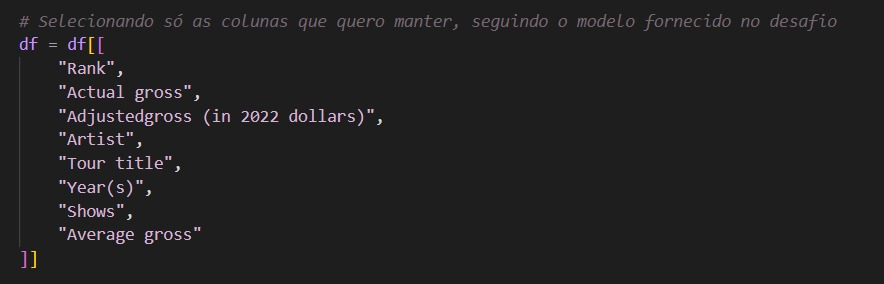
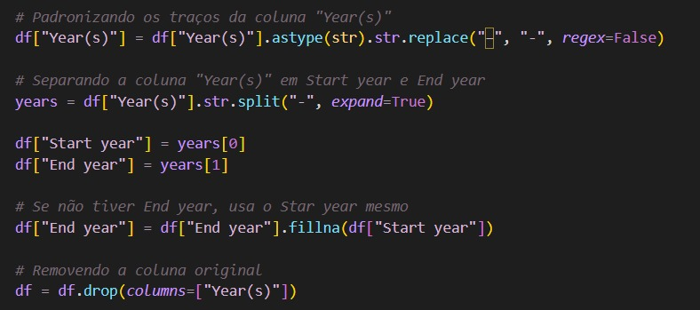
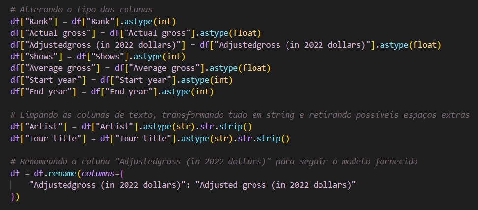
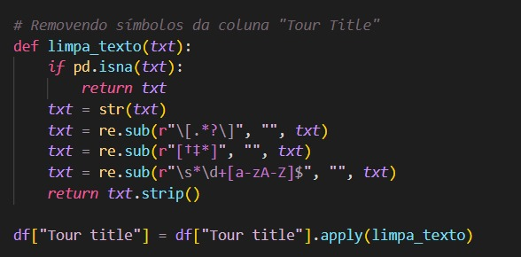
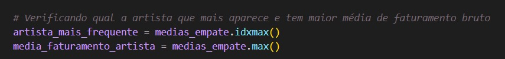
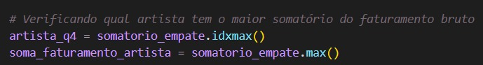
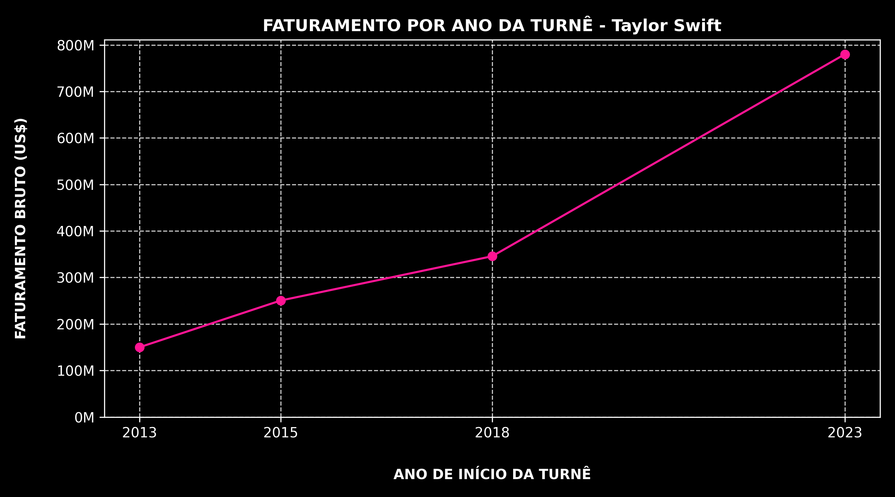
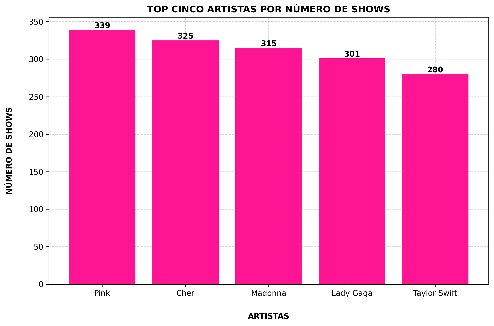
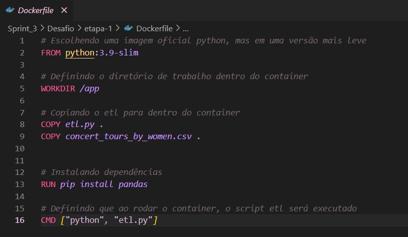
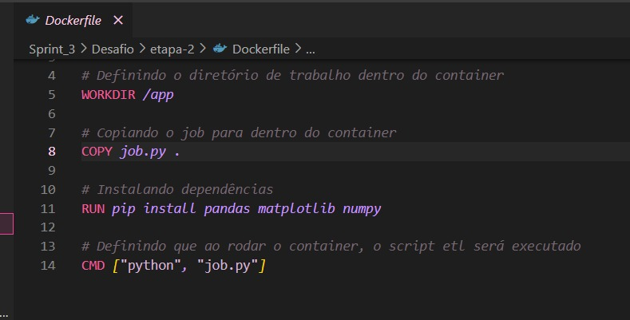

# DESAFIO

## ETAPA 1 - Limpeza de dados
Antes do efetivo script em .py, utilizei o jupyter notebook para uma mais rápida visualização dos dados e dos erros, já que lá é possível trabalhar célula por célula. Esse arquivo inicial está [aqui](https://github.com/aline-hoffmann/scholarship-compass/blob/main/Sprint_3/Desafio/etapa-1/etl.ipynb).

Para iniciar a limpeza de dados, importei as bibliotecas pandas, re e os, já que precisaria delas para manipular o CSV, usar regex na limpeza e trabalhar com os caminhos das pastas.

````
import pandas as pd
import re
import os
````

Após ler o arquivo "concert_tours_by_women.csv", selecionei apenas as colunas necessárias, conforme o modelo que me foi passado no desafio.



Na coluna dos anos das turnês, foi necessário fazer uma divisão. Sendo assim, padronizei os traços de separação dos anos e dividi a coluna "Year(s)" nas colunas "Start year" e "End Year", excluindo a coluna original.



Para a limpeza das colunas onde se tratava de dinheiro, removi os caracteres que não fossem pontos ou números.

````
def limpa_dinheiro(valor):
    if isinstance(valor, str):
        valor = re.sub(r"[^0-9.]", "", valor)
        if valor == "":
            return 0.0
        return float(valor)
    return float(valor)
````

Ademais, alterei os tipos das colunas e, nas de texto, transformei tudo em string e removi possíveis espaçoes em branco. Além disso, renomeei a coluna "Adjustedgross (in 2022 dollars)" para seguir o modelo fornecido.



Na coluna "Tour Tittle" foi necessário fazer uma limpeza mais profunda, pois existiam muitos tipos de símbolos nos nomes das turnês.

 


Para finalizar, determinei que o arquivo csv fosse salvo na pasta "volume", para que mais adiante fosse lido pelo "docker-compose.yml".

````
output_path = os.path.join(os.path.dirname(__file__), "..", "volume", "csv_limpo.csv")
df.to_csv(output_path, index=False, encoding="utf-8")
````

O arquivo etl.py pode ser lido [aqui](https://github.com/aline-hoffmann/scholarship-compass/blob/main/Sprint_3/Desafio/etapa-1/etl.py) na íntegra.

## ETAPA 2 - Questões
Para a resolução das questões da segunda etapa, também utilizei primeiro o jupyter notebook e o arquivo dele está [aqui](https://github.com/aline-hoffmann/scholarship-compass/blob/main/Sprint_3/Desafio/etapa-2/job.ipynb).

### Questão 1.
Para descobrir a artista que mais apareceu na lista e qual teve a maior média de faturamento bruto (Actual gross), primeiro eu fiz a contagem de quantas vezes cada artista aparecia na lista.

````
artistas_contagem = df['Artist'].value_counts()
````

Verifiquei que Taylor Swift e Madonna ficavam empatadas, aparecendo ambas quatro vezes. Após isso, calculei a média do faturamento bruto (Actual gross) dessas duas artistas.

````
medias_empate = df.groupby("Artist")["Actual gross"].mean().loc[artistas_empate]
````

Ademais, descobri qual a artista que mais aparecia e tinha maior média de faturamento bruto, sendo a Taylor Swift, com média de $381,518,786.50 USD.

 


### Questão 2.
Para resolver essa questão, eu filtrei somente as turnês em que o Start year e o End year eram iguais, ou seja, que aconteceram dentro de um único ano.

````
turnes_mesmo_ano = df[df["Start year"] == df["End year"]]

````

A partir disso, eu utilizei idxmax() para encontrar qual turnê tinha o maior valor de Average gross.

````
maior_gross = turnes_mesmo_ano.loc[turnes_mesmo_ano["Average gross"].idxmax()]
`````

Assim identifiquei que turnê de maior média de faturamento dentro de um único ano foi 'Renaissance World Tour' da artista Beyoncé, com média de faturamento de $10,353,571.00 USD.

### Questão 3.
Aqui eu criei uma nova coluna chamada Bruto por show, que foi calculada dividindo o Adjusted gross (in 2022 dollars) pelo número de Shows.

````
df["Bruto por show"] = df["Adjusted gross (in 2022 dollars)"] / df["Shows"]
````

Em seguida, eu ordenei essa coluna de forma decrescente e selecionei as três primeiras linhas usando head(3).

````
top3 = df.sort_values("Bruto por show", ascending=False).head(3)
````

Dessa forma, obtive as três turnês mais lucrativas por show, sendo elas:
1. The Eras Tour — Taylor Swift — Bruto por show: $13,928,571.43
2. Renaissance World Tour — Beyoncé — Bruto por show: $10,353,571.43
3. Reputation Stadium Tour — Taylor Swift — Bruto por show: $7,600,846.21
<br>
<br>


**Depois de resolver as três primeiras questões, eu agrupei as respostas em texto e salvei todas elas dentro do arquivo respostas.txt, que ficou disponível na pasta "volume" e pode ser visualizado [aqui](https://github.com/aline-hoffmann/scholarship-compass/blob/main/Sprint_3/Desafio/volume/respostas.txt).**

### Questão 4.
Para a quarta questão, eu utilizei o resultado da Questão 1, pegando as artistas que mais apareciam na lista e, dessa vez, desempatando pelo  pelo somatório do faturamento bruto.



Verifiquei que a artista que mais aparece e tem maior somatório de faturamento bruto segue sendo a Taylor Swift. Sendo assim, filtrei apenas os dados dela e agrupei por ano de início (Start year), somando os valores de Actual gross de cada ano.

Após isso, criei um gráfico de linhas para demonstrar o faturamento bruto anual de Taylor Swift, salvando a imagem do gráfico dentro da pasta volume.



### Questão 5.
Para descobri quais as cinco artistas com mais shows, eu agrupei os dados por artista e somei a quantidade de Shows.

````
shows_por_artista = df.groupby("Artist")["Shows"].sum()
````
Após isso, selecionei apenas as cinco artistas com mais shows.

````
top5_artistas_shows = shows_por_artista.sort_values(ascending=False).head(5)
````

Ademais, criei um gráfico de barras para demonstrar o resultado e salvei a imagem na pasta volume também.



## ETAPA 3
Nessa terceira etapa, criei um arquivo Dockerfile com o script etl criado na etapa um.



Esse arquivo pode ser visualizado [aqui](https://github.com/aline-hoffmann/scholarship-compass/blob/main/Sprint_3/Desafio/etapa-1/Dockerfile).

## ETAPA 4
Na quarta etapa, também criei um arquivo Dockerfile, porém, dessa vez com o script job criado na etapa dois.



Esse arquivo pode ser visualizado [aqui](https://github.com/aline-hoffmann/scholarship-compass/blob/main/Sprint_3/Desafio/etapa-2/Dockerfile).

## ETAPA 5