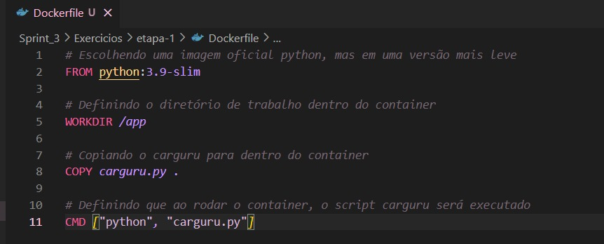
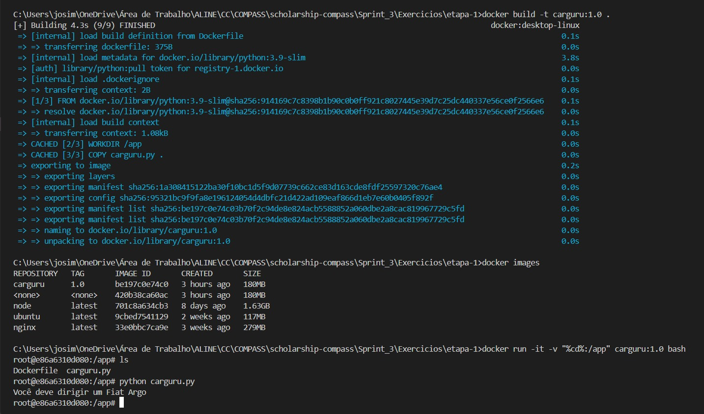
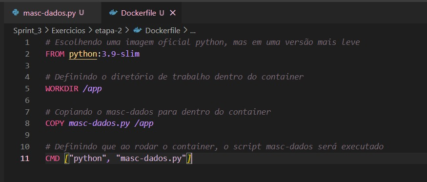
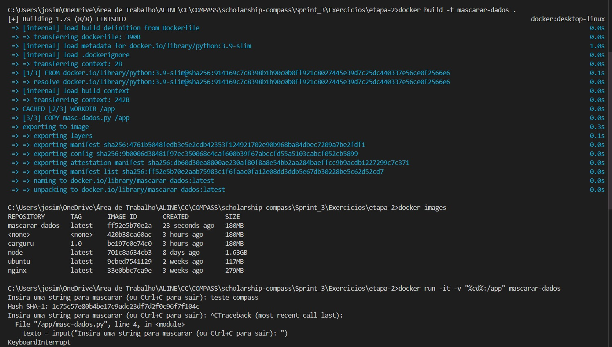

# Exercícios

## ETAPA 1.
Na etapa 1, o script de "carguru" já estava pronto. Sendo assim, só foi necessário criar o Dockerfile e a imagem. Após isso, executei um container partindo da imagem criada.

### Dockerfile


### Imagem
Para a criação da imagem, utilizei o seguinte comando no terminal:
````
docker build -t carguru:1.0 .
````

### Container
Após a criação da imagem, executei um container utilizando ela.

````
docker run -it -v "%cd%:/app" carguru:1.0 bash
````

### Execução do container


## ETAPA 2
Na segunda etapa, foi preciso criar o script python no Dockerfile, para então criar a imagem e executar o container partindo dela.

### Script python
Eu utilizei a biblioteca hashlib no script Python para transformar qualquer string digitada pelo usuário em um hash SHA-1. O programa funcionava em um laço infinito (while True), onde era solicitado que a pessoa inserisse uma string pelo teclado. Em seguida, essa string era convertida em bytes, o hash era gerado com hashlib.sha1() e o resultado era exibido em formato hexadecimal com hexdigest(). Após isso, o programa retornava ao início e pedia uma nova entrada, repetindo o processo até ser interrompido manualmente (por exemplo, com Ctrl+C).

````
import hashlib

while True:
    texto = input("Insira uma string para mascarar (ou Ctrl+C para sair): ")
    hash_obj = hashlib.sha1(texto.encode())
    print("Hash SHA-1:", hash_obj.hexdigest())
````

### Dockerfile


### Imagem
Para a criação da imagem, utilizei o seguinte comando no terminal:
````
docker build -t mascarar-dados .
````

### Container
Após a criação da imagem, executei um container utilizando ela.

````
docker run -it -v "%cd%:/app" mascarar dados
````

### Execução do container



<br>
<br>

## [EVIDÊNCIAS](https://github.com/aline-hoffmann/scholarship-compass/tree/main/Sprint_3/Evidencias/Exercicios)