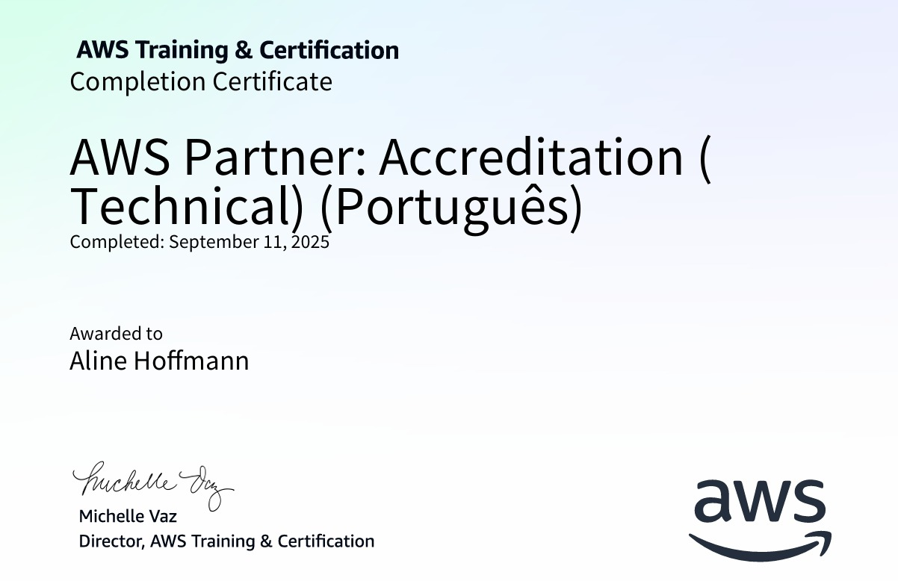

# 📍 SPRINT 3 

Esta sprint consistiu em um estudo aprofundado em três áreas complementares: Docker, Regex e AWS. Além dos conceitos teóricos, todas as aprendizagens foram aplicadas em um desafio prático utilizando dados de turnês de artistas, que se revelou uma experiência altamente enriquecedora e desafiadora. 
 
 

## DOCKER
No Docker, iniciei pelo entendimento dos **containers**, aprendendo a criá-los, executá-los e gerenciá-los de maneira eficiente. Posteriormente, avancei para a construção de imagens personalizadas por meio de **Dockerfile**, encapsulando todas as dependências necessárias para garantir que a aplicação funcione de forma consistente em qualquer ambiente.

Um aspecto relevante foi a utilização de **volumes**, que permitem a persistência de dados mesmo após a finalização do container, algo essencial para o desafio, no qual era necessário preservar os arquivos de saída.

Além disso, explorei a comunicação entre containers por meio de redes configuradas e organizei essas definições em arquivos YAML, o que possibilitou a utilização do **Docker Compose** para orquestrar múltiplos containers, definir dependências e automatizar a execução do fluxo.

Por fim, tive contato com o **Docker Swarm**, o que proporcionou uma visão de escalabilidade de containers em clusters, demonstrando como aplicações complexas crescem e exigem gestão adequada de infraestrutura.
 
 

## REGEX
O estudo de Regex permitiu a manipulação precisa de dados textuais. Apesar de parecer complexa inicialmente, esta ferramenta demonstrou-se extremamente eficiente para resolver problemas de forma concisa.

No contexto do desafio, Regex foi empregada para **limpar valores monetários, padronizar colunas de anos e corrigir inconsistências nos nomes de turnês**. Essa abordagem tornou a limpeza de dados mais ágil e precisa, evidenciando a importância dessa técnica em processos de transformação de dados.
 
 

## AWS
O curso de AWS proporcionou uma perspectiva estratégica da computação em nuvem. Foram explorados o Console de Gerenciamento da AWS e serviços fundamentais como computação, armazenamento, redes, bancos de dados e segurança.

Além disso, foram abordadas estratégias de migração de cargas de trabalho para a nuvem, integrando aspectos técnicos e de negócio de forma coesa.

O certificado desse curso pode ser visualizado logo abaixo ou clicando [aqui](https://github.com/aline-hoffmann/scholarship-compass/blob/main/Sprint_3/Certificados/certificado-aws.pdf) para acessar o PDF.

 
 
 

## [EXERCÍCIOS](https://github.com/aline-hoffmann/scholarship-compass/tree/main/Sprint_3/Exercicios)
 

## DESAFIO

O desafio aplicado durante a sprint permitiu a integração de todas as áreas estudadas. Trabalhei com um dataset de turnês de artistas, desenvolvendo um processo completo de ETL. A utilização de Python, Pandas e Regex possibilitou a limpeza e a análise dos dados de maneira eficiente.

Em seguida, o Docker foi empregado para criar containers específicos para cada etapa do processo, sendo orquestrados por meio do Docker Compose. Os volumes garantiram a persistência dos resultados, incluindo arquivos CSV, relatórios em texto e gráficos, mesmo após a execução dos containers.

O exercício evidenciou a convergência entre programação, manipulação de dados e containerização, permitindo a construção de um fluxo operacional coerente e eficiente.

Todos os passos do desafio, assim como seus resultados podem ser verificados [aqui](https://github.com/aline-hoffmann/scholarship-compass/tree/main/Sprint_3/Desafio).
 
 
 

## [EVIDÊNCIAS](https://github.com/aline-hoffmann/scholarship-compass/tree/main/Sprint_3/Evidencias)