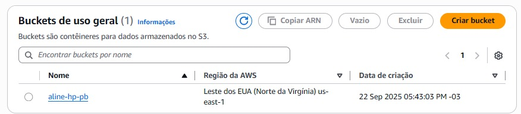

## ETAPA 1

Após a importação da biblioteca "boto3" para interagir com a AWS, criei o bucket "aline-hp-pb", através do comando a seguir e verifiquei o mesmo no painel da AWS.

````
s3.create_bucket(Bucket='aline-hp-pb')
````

