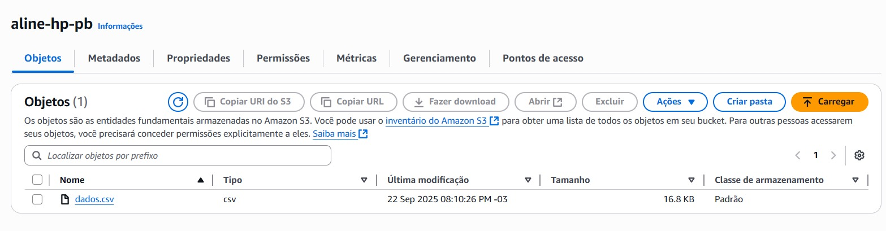
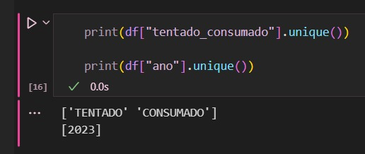
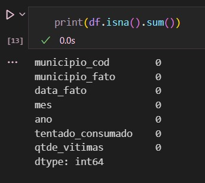
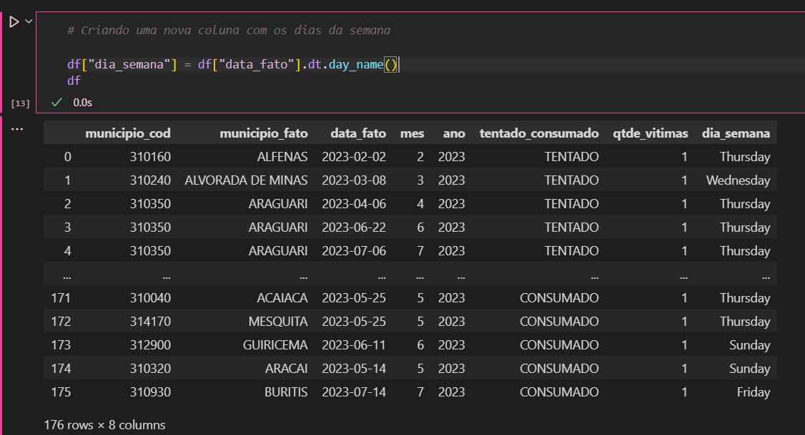
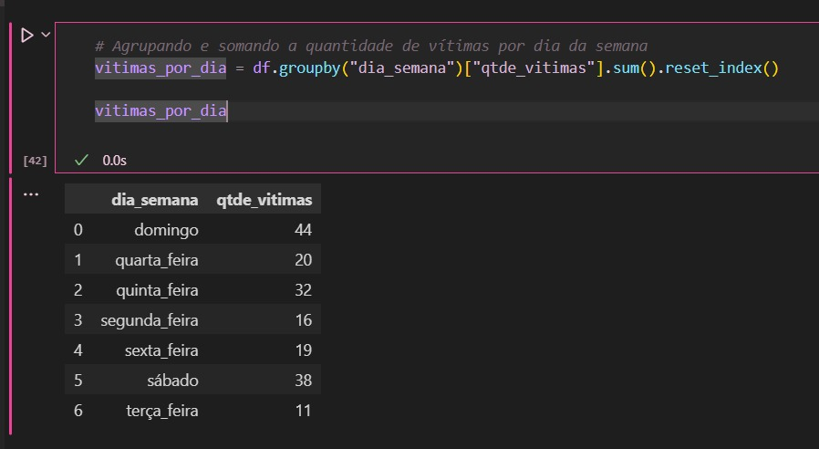
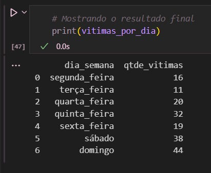
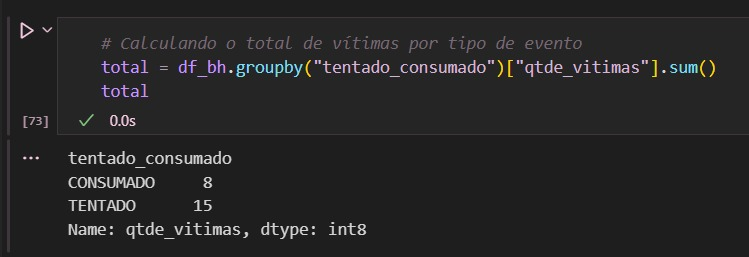
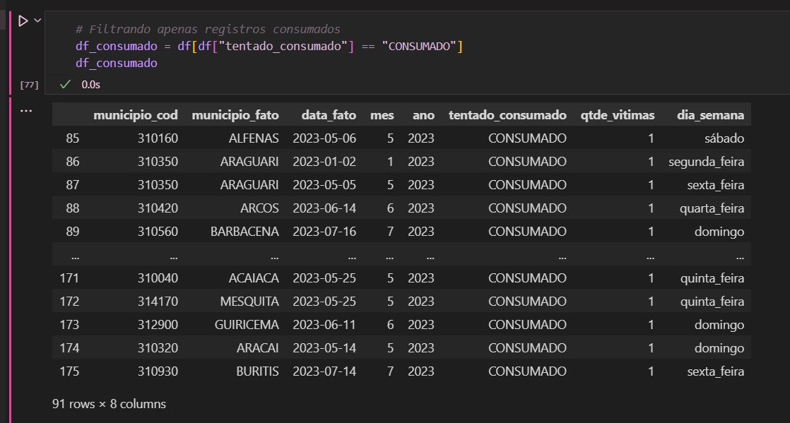
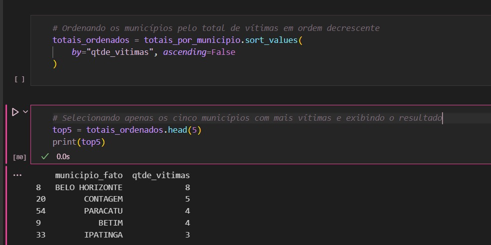
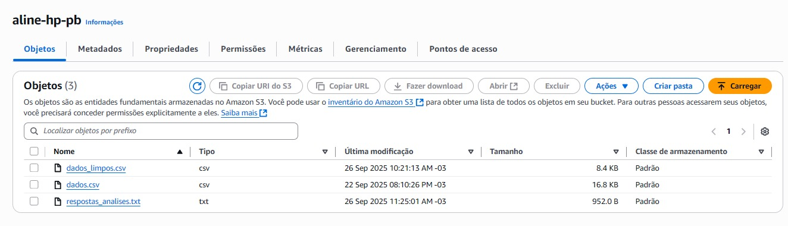

## **ETAPA 1**
Primeiramente, defini os questionamentos que iria responder com a análise dos dados "Feminicídios 2023 - Estado de Minas Gerais, sendo eles:

1) Será que o dia da semana influencia no feminicídio? Verifique o número de vítimas em cada dia da semana.
2) Qual a soma de cada tipo dos eventos Tentado e Consumado no município de Belo Horizonte? A maioria dos eventos chega a ser consumado?
3) Quais os cinco municípios com mais vítimas? Considere apenas os registros consumados.

Após a importação da biblioteca "boto3" para interagir com a AWS, criei o bucket "aline-hp-pb", através do comando a seguir e verifiquei o mesmo no painel da AWS.

````
s3.create_bucket(Bucket='aline-hp-pb')
````


Depois da criação do bucket, fiz o upload dos dados que irei utilizar para as análises na segunda etapa.

````
s3.upload_file(arquivo_local, bucket_name, nome_s3)
````



## **ETAPA 2**

Para fazer a leitura do arquivo csv, fiz a conexão com o S3 e com o meu bucket.

````
s3 = boto3.client('s3')
bucket = "aline-hp-pb"
key = "dados.csv"
````

Logo após, fiz a leitura do CSV diretamente do s3.

````
obj = s3.get_object(Bucket=bucket, Key=key)
data = obj['Body'].read().decode('utf-8')
df = pd.read_csv(StringIO(data), sep=';')
````

Conseguindo ler o csv, iniciei a limpeza dos dados. Para começar, excluí as colunas "risp" e "rmbh" pois não vou utilizar para a análise.

````
df = df.drop(columns=["risp", "rmbh"])
````

Seguindo a limpeza, conferi os tipos de dados das coluna através do "df.dtypes" e padronizei as com valores númericos, datas e strings.

````
df["municipio_cod"] = pd.to_numeric(df["municipio_cod"], errors="coerce", downcast="integer")
df["data_fato"] = pd.to_datetime(df["data_fato"], format="%d/%m/%Y", errors="coerce")
df["mes"] = pd.to_numeric(df["mes"], errors="coerce", downcast="integer")
df["ano"] = pd.to_numeric(df["ano"], errors="coerce", downcast="integer")
df["qtde_vitimas"] = pd.to_numeric(df["qtde_vitimas"], errors="coerce", downcast="integer")

df["municipio_fato"] = df["municipio_fato"].str.strip().str.upper()
df["tentado_consumado"] = df["tentado_consumado"].str.strip().str.upper()
````

Ademais, removi possíveis linhas duplicadas e reorganizei o indíce, caso alguma coisa tenha sido excluída.

````
df = df.drop_duplicates()

df = df.reset_index(drop=True)
````

Para garantir o padrão, consultei se na coluna "tentado_consumado" só existia valores com esses dois resultados e na coluna "ano" só existia 2023.



Por fim, verifiquei se existia algum valor nulo.



Salvei o arquivo csv depois da limpeza de dados e comecei as análises.

### **QUESTIONAMENTO 1.**
Qual o total de vítimas para cada dia da semana?

Para iniciar, garanti que a coluna "data_fato" estivesse no formato datatime e, logo após, criei uma nova coluna com os dias da semana, chamando de "dia_semana".



Para padronizar os dados na língua portuguesa, fiz a tradução.

````
# Traduzindo os dias da semana para português
traducao_dias = {
    "Monday": "segunda_feira",
    "Tuesday": "terça_feira",
    "Wednesday": "quarta_feira",
    "Thursday": "quinta_feira",
    "Friday": "sexta_feira",
    "Saturday": "sábado",
    "Sunday": "domingo"
}
df["dia_semana"] = df["dia_semana"].replace(traducao_dias)
````

Depois de traduzidos os dias da semana, agrupei-os e somei a quantidade de vítimas em cada um deles.



Após isso, reordenei o resultado para que fossem mostrados os dias da semana na ordem correta.

````
ordem_dias = ["segunda_feira", "terça_feira", "quarta_feira", "quinta_feira", "sexta_feira", "sábado", "domingo"]

vitimas_por_dia = vitimas_por_dia.set_index("dia_semana").reindex(ordem_dias).reset_index()
````

Sendo assim, verificando o resultado final, **obtive a resposta do meu questionamento: sim. Existe influência dos dias da semana nos casos de feminicídio, vez que aos finais de semana existe uma maior quantidade de ocorrências em comparação com os demais dias.**



### **QUESTIONAMENTO 2** 
Qual a soma de cada tipo dos eventos Tentado e Consumado? A maioria dos eventos chega a ser comumado?

Para fazer essa análise, iniciei filtrando apenas os resultados do município de Belo Horizonte

````
df_bh = df[df["municipio_fato"] == "BELO HORIZONTE"]
````

Após isso, calculei o total de vítimas por tipo de evento.



Ademais, criei uma nova coluna com a classificação do tipo do evento, como o tentado sendo predominante e o consumado não predominante. Assim, **obtive a resposta do meu  questionamento: no caso dos crimes tentados, temos 15 ocorrências em Belo Horizonte. Já os consumados somam 8. Dessa forma, não, nem todos os crimes chegam a ser consumados, existe predominância da tentativa.**

### **Questionamento 3.** 
Quais os cinco municípios com mais vítimas? Considere apenas os registros consumados.

Em um primeiro momento, filtrei apenas os eventos consumados.



Após isso, agrupei o resultado por municípios e somei a quantidade de vítimas.

````
totais_por_municipio = (
    df_consumado.groupby("municipio_fato")["qtde_vitimas"].sum().reset_index()
)
````

Além disso, ordenei os municípios em ordem descrescente e selecionei apenas os cinco primeiros. Dessa forma, **obtive a resposta do meu questionamento: os cinco municípios com maior número de vítimas, considerando apenas eventos consumados são: Belo Horizonte, Contagem, Paracatu, Betim e Ipatinga.**



Para concluir o desafio, **criei um arquivo txt com a resposta dos três  questionamentos** e realizei o envio para o meu bucket com o nome de **"respostas_analises.txt"**.

````
s3.put_object(
    Bucket=bucket,
    Key='respostas_analises.txt', 
    Body=respostas.encode('utf-8') 
)
````


