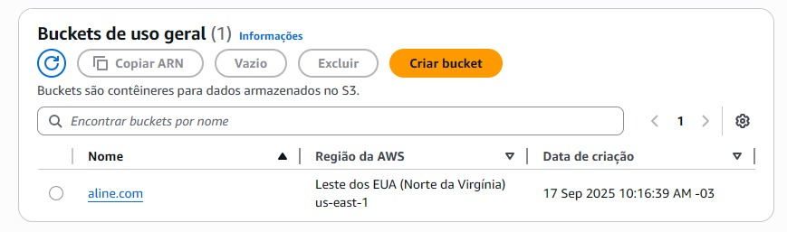
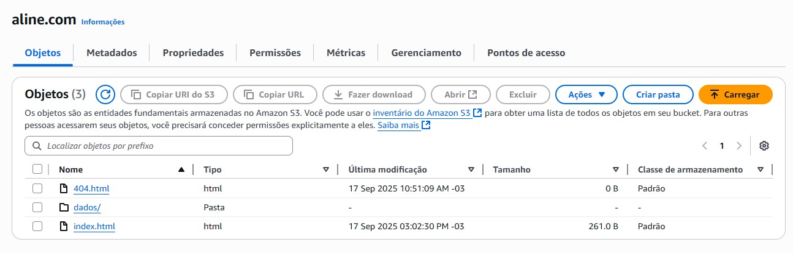
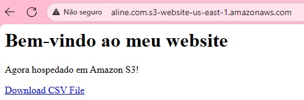
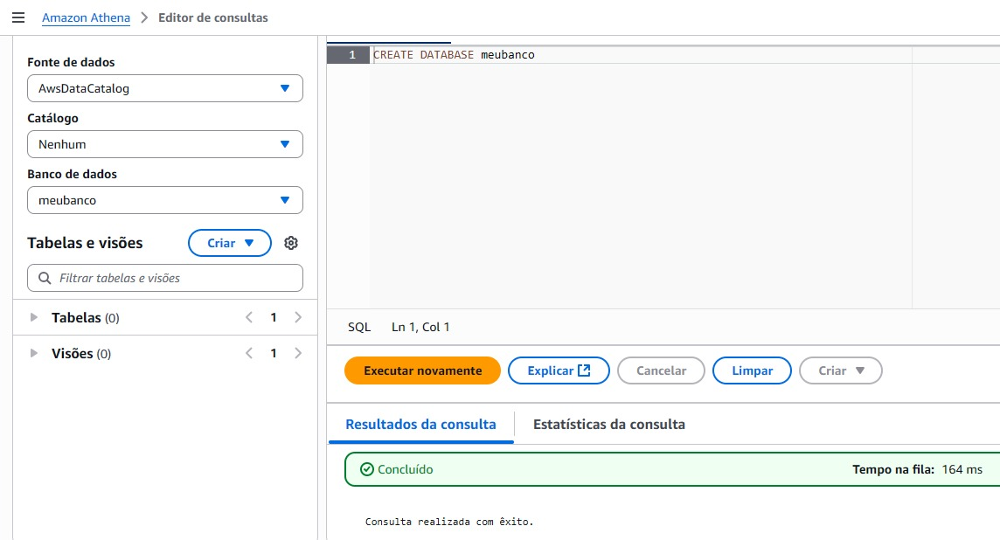
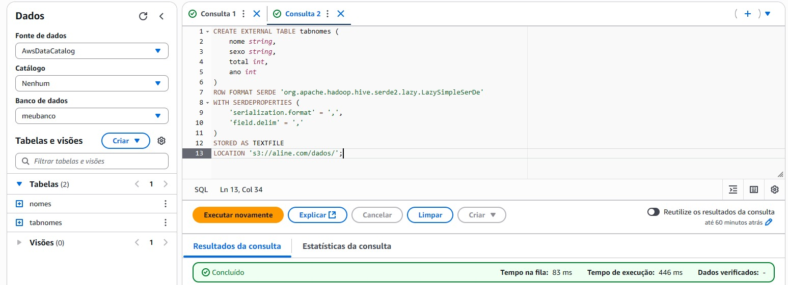
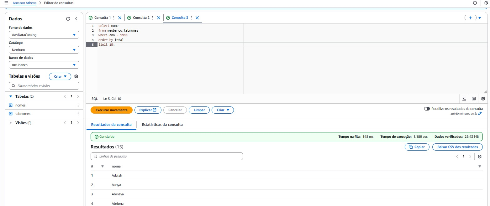
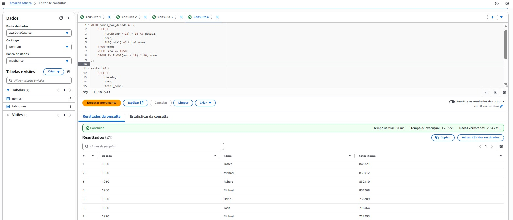

# LABORATÓRIOS

## LAB AWS S3

Criei um bucket com o nome "aline.com" e escolhei a região "US East (N. Virginia) us-east-1".



Em seguida, habilitei a opção de hospedagem de site estático e configurei o index.html como documento inicial e o 404.html como página de erro personalizada.

Para permitir que o site fosse acessado publicamente, desabilitei o bloqueio de acesso público e adicionei uma política de bucket que libera permissão de leitura para qualquer usuário, sendo ela:

````{
    "Version": "2012-10-17",
    "Statement": [
        {
            "Sid": "PublicReadGetObject",
            "Effect": "Allow",
            "Principal": "*",
            "Action": [
                "s3:GetObject"
            ],
            "Resource": [
                "arn:aws:s3:::aline.com/*"
            ]
        }
    ]
}
````

Depois disso, fiz o upload do arquivo index.html que funciona como a página principal, criei uma pasta chamada dados/ para armazenar o arquivo CSV ("nomes.csv") e adicionei também o arquivo 404.html.



Por fim, copiei o endpoint fornecido pelo S3 e testei no navegador, confirmando que o site estava disponível publicamente e que os arquivos podiam ser acessados através da hospedagem estática.



<br>

## LAB AWS ATHENA
Dentro do meu bucket (aline.com), criei a pasta queries para armazenar os resultados das consultas do Athena.

Após isso, criei um banco de dados chamado de "meubanco".

````
CREATE DATABASE meubanco
````



Ademais, criei uma tabela (tabnomes) baseada no arquivo "nomes.csv", defini os tipos de dados das colunas e utilizei o LazySimpleSerDe para leitura de CSV delimitado por vírgulas. Também especifiquei o caminho da pasta no S3 como local da tabela.

````CREATE EXTERNAL TABLE tabnomes (
    nome string,
    sexo string,
    total int,
    ano int
)
ROW FORMAT SERDE 'org.apache.hadoop.hive.serde2.lazy.LazySimpleSerDe'
WITH SERDEPROPERTIES (
    'serialization.format' = ',',
    'field.delim' = ','
)
STORED AS TEXTFILE
LOCATION 's3://aline.com/dados/';
````



Testei a importação com uma consulta simples, filtrando por ano e limitando resultados.

````
select nome
from meubanco.tabnomes
where ano = 1999 
order by total 
limit 15;
````



Por fim, para verificar quais os três nomes mais usados em cada década, de 1950 até hoje utilizei a seguinte query:

````WITH nomes_por_decada AS (
    SELECT
        FLOOR(ano / 10) * 10 AS decada,
        nome,
        SUM(total) AS total_nome
    FROM nomes
    WHERE ano >= 1950
    GROUP BY FLOOR(ano / 10) * 10, nome
),

ranked AS (
    SELECT
        decada,
        nome,
        total_nome,
        ROW_NUMBER() OVER (PARTITION BY decada ORDER BY total_nome DESC) AS rn
    FROM nomes_por_decada
)

SELECT
    decada,
    nome,
    total_nome
FROM ranked
WHERE rn <= 3
ORDER BY decada, total_nome DESC;
````

