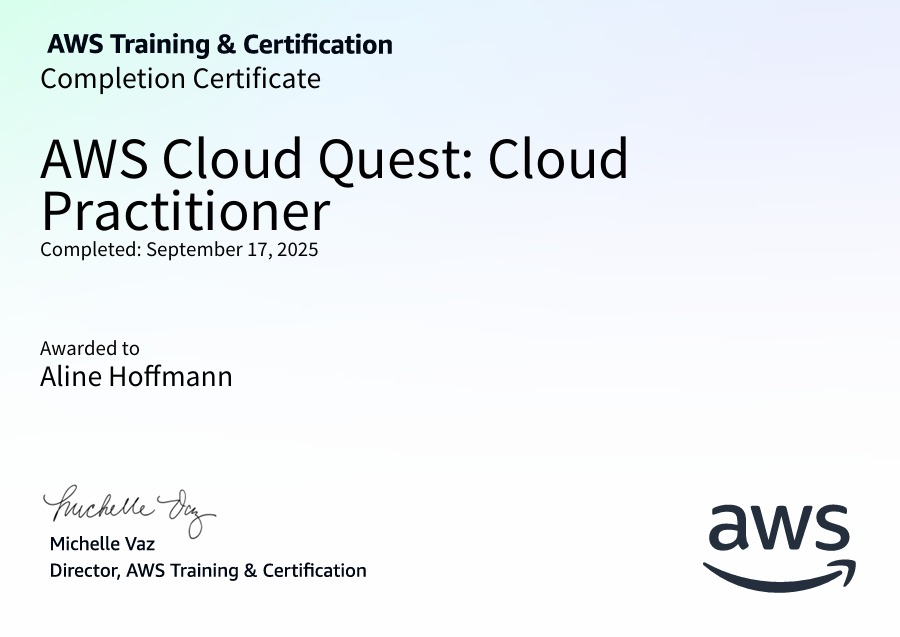
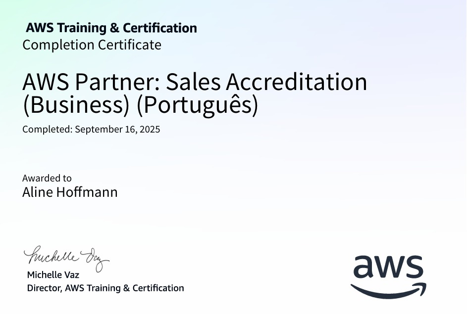
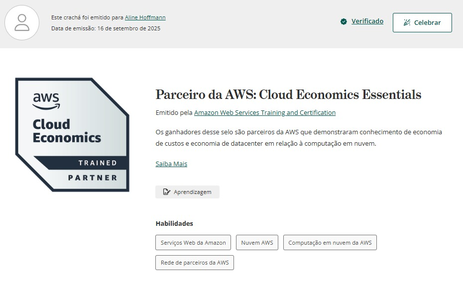

# **SPRINT 4**

A quarta sprint foi muito voltada para a AWS. Nela realizei cursos e muitos laboratórios práticos para exercitar o aprendizado.

## **AWS Sales Accreditation**
O primeiro treinamento realizado nesta sprint foi o AWS Sales Accreditation, disponível na plataforma AWS Skill Builder. Esse curso teve como foco desenvolver habilidades de comunicação e relacionamento comercial, ensinando a transmitir de forma clara e objetiva a proposta de valor da AWS para diferentes perfis de clientes. Nele, aprendi a como estruturar conversas de vendas, demonstrar os benefícios estratégicos e técnicos da nuvem, além de explorar o papel dos parceiros AWS no processo de aquisição e implementação das soluções.

Também foram trabalhados aspectos importantes como a identificação das necessidades do cliente, a apresentação de soluções alinhadas a essas demandas e as melhores formas de superar objeções comuns que podem surgir durante o processo de decisão. Esse aprendizado foi essencial para compreender não apenas a tecnologia, mas também a visão de negócios que a AWS proporciona.

## **AWS Cloud Economics**
O segundo curso concluído foi o AWS Cloud Economics, oferecido pelo programa AWS Partner. Esse treinamento aprofundou-se na importância da gestão de custos e do valor comercial ao migrar ou operar cargas de trabalho na nuvem. Durante o curso, tive contato com o AWS Cloud Value Framework, que apresenta os quatro principais pilares que sustentam a proposta de valor da nuvem: redução de custos, aumento da produtividade, resiliência operacional e agilidade nos negócios.

Além disso, foram apresentados conceitos fundamentais de gerenciamento financeiro em ambientes de nuvem, como práticas de FinOps, análises de ROI (retorno sobre investimento), TCO (custo total de propriedade) e boas práticas para otimização de gastos em nuvem. O curso foi essencial para entender como mostrar aos clientes não apenas os benefícios tecnológicos, mas também o impacto direto no desempenho econômico e estratégico das empresas que adotam AWS.

## **AWS Cloud Quest**
Por fim, participei do AWS Cloud Quest, uma experiência prática em formato de jogo que complementou muito bem os cursos teóricos. Diferente de um curso tradicional, essa atividade se estruturou em 12 desafios interativos, cada um abordando um ou mais serviços da AWS. Entre os serviços explorados, estavam EC2 (máquinas virtuais), EBS (armazenamento em bloco), S3 (armazenamento em objetos), DynamoDB (banco de dados NoSQL), entre muitos outros.

Em cada tarefa, era necessário compreender a situação proposta, aplicar o conhecimento técnico e configurar os recursos adequadamente, simulando cenários do mundo real. Essa dinâmica lúdica possibilitou experimentar, de forma prática e envolvente, como construir soluções na nuvem e administrar diferentes serviços de forma integrada. Foi uma oportunidade de consolidar os aprendizados anteriores, colocando a mão na massa e visualizando na prática como a AWS pode ser aplicada em diferentes contextos e necessidades.
 
 

## [EXERCÍCIOS](https://github.com/aline-hoffmann/scholarship-compass/tree/main/Sprint_4/Exercicios)

## [EVIDÊNCIAS](https://github.com/aline-hoffmann/scholarship-compass/tree/main/Sprint_4/Evidencias) 
 
 

## [CERTIFICADOS](https://github.com/aline-hoffmann/scholarship-compass/tree/main/Sprint_4/Certificados)

[**AWS Cloud Quest: Praticante de nuvem:**](https://github.com/aline-hoffmann/scholarship-compass/blob/main/Sprint_4/Certificados/certifcado-cloud-quest.pdf)

 
 

[**AWS Partner: Sales Accreditation:**](https://github.com/aline-hoffmann/scholarship-compass/blob/main/Sprint_4/Certificados/certificado-sales-accreditation.pdf)

 
 

[**AWS Partner: Cloud Economics Essentials:**](https://www.credly.com/badges/22f5e524-8a5a-4877-9e55-4d37413bc27d)

 
 

## **DESAFIO**

O desafio da Sprint 4 teve como foco aplicar na prática os conhecimentos adquiridos sobre a plataforma AWS, com ênfase no serviço Amazon S3. A proposta consistia em utilizar um conjunto de dados disponibilizado pelo site do governo, realizar a etapa de limpeza e organização dessas informações e, em seguida, armazená-las em um bucket no S3.

Depois disso, precisávamos resgatar o arquivo diretamente do bucket e conduzir três análises distintas, cada uma delas incorporando diferentes tipos de manipulação de dados. Entre os requisitos, estavam o uso de cláusulas de filtro com operadores lógicos, funções de agregação, condicionais, conversões, além de operações envolvendo datas ou strings. Dessa forma, cada análise deveria contemplar ao menos uma dessas manipulações, garantindo a aplicação prática e diversificada dos conceitos trabalhados.

Todos os passos e etapas do desafio, assim como seus resultados, podem ser visualizados [aqui.](https://github.com/aline-hoffmann/scholarship-compass/tree/main/Sprint_4/Desafio)

