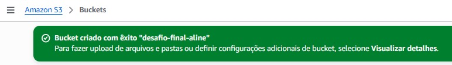
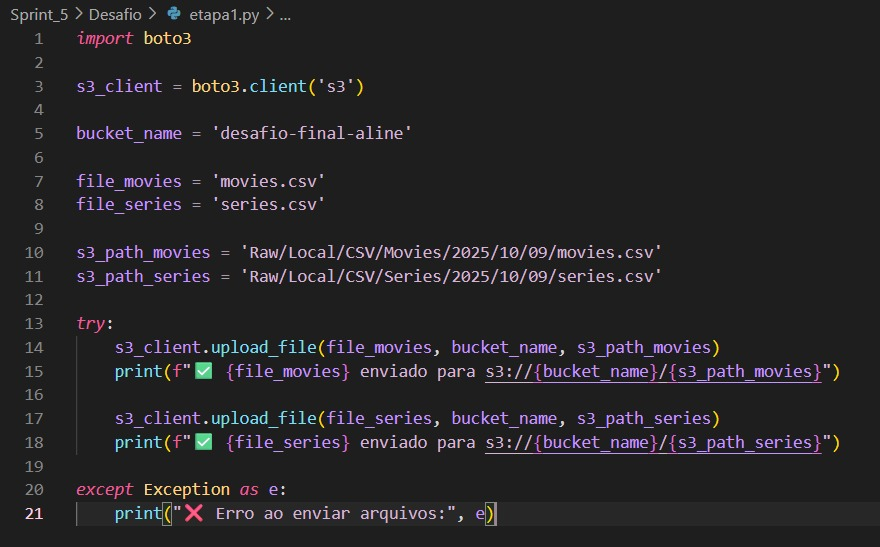
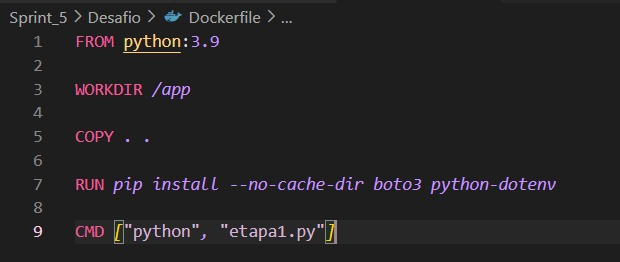
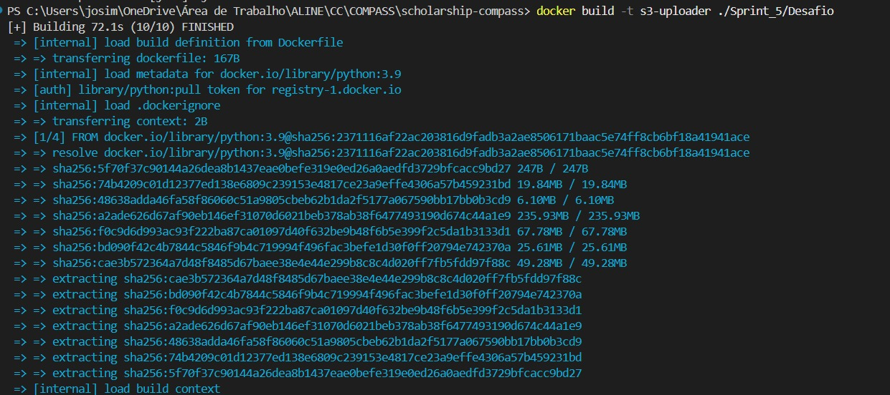
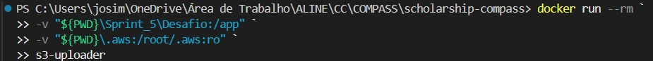
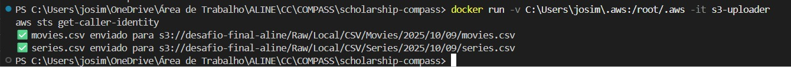
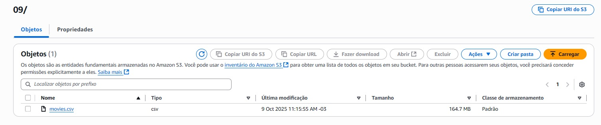
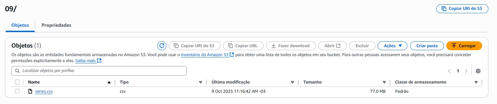

# DESAFIO

Antes de iniciar as efetivas etapas do desafio, tínhamos que formular questões que os dados constantes no csv fornecido e na API do TMDB deveriam responder.

Ademais, essas perguntas deveriam ser formuladas a respeito apenas dos filmes pertencentes a categoria definidada para cada Squad.

Como faço parte do **Squad 1**, minha cetegoria de filmes foi **Comédia/Animação**. Sendo assim, defini os seguintes questionamentos:

1. Quais são os artistas mais recorrentes em filmes de comédia?

2. Existe diferença de nota média entre comédias estreladas por homens e por mulheres?

3. Qual a média de duração dos filmes de comédia? Há uma tendência de comédias mais longas ou mais curtas nos últimos anos?

4. Existe relação entre o orçamento e a nota média dos filmes de comédia?

## ETAPA 1

Iniciei criando um bucket manualmente, chamando-o de "desafio-final-aline" e dasabilidando a opção de bloquear acesso público.



Após isso, criei o arquivo python para fazer upload dos arquivos "movies.csv" e "series.csv" para o meu bucket na AWS.

Iniciei importando a biblioteca "boto3" para interagir com a AWS.

````
import boto3
````

Após isso, criei um cliente para se comunicar com o serviço s3.

````
s3_client = boto3.client('s3')
````

Ademais, defini o bucket, arquivos locais e os caminhos dentro do s3, especificando onde os arquivos deveriam ficar no bucket.

````
bucket_name = 'desafio-final-aline'

file_movies = 'movies.csv'
file_series = 'series.csv'

s3_path_movies = 'Raw/Local/CSV/Movies/2025/10/09/movies.csv'
s3_path_series = 'Raw/Local/CSV/Series/2025/10/09/series.csv'
````

Além disso, dei as instruções para envio dos arquivos para o bucket na AWS, tratando erros e definindo as mensagens de sucesso ou de problema.

````
try:
    s3_client.upload_file(file_movies, bucket_name, s3_path_movies)
    print(f"✅ {file_movies} enviado para s3://{bucket_name}/{s3_path_movies}")

    s3_client.upload_file(file_series, bucket_name, s3_path_series)
    print(f"✅ {file_series} enviado para s3://{bucket_name}/{s3_path_series}")

except Exception as e:
    print("❌ Erro ao enviar arquivos:", e)
````



Depois de definido o código python, criei um arquivo Dockerfile. Esse Dockerfile cria um container Python 3.9, copia os arquivos do projeto, instala as dependências boto3 e python-dotenv, e define que o script "etapa1.py" será executado automaticamente ao iniciar o container.



Assim, através do comando "docker build -t s3-uploader ./Sprint_5/Desafio" eu criei a imagem e rodei com o "docker-run --rm ` ", criando os volumes necessários.




Com isso, realizei o upload dos arquivos para o meu bucket na AWS, fazendo a verificação posteriormente.





## ETAPA 2

Na etapa dois, deveríamos captar dados do TMDB via AWS LAMBDA para complementar os dados dos filmes e séries do csv, realizando requisições para a API.

Para decidir o que eu ia trazer do TMDB, iniciei verificando qual o **ID dos gêneros de filme comédia e animação, sendo 35 e 16, respectivamente**.