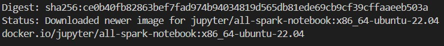
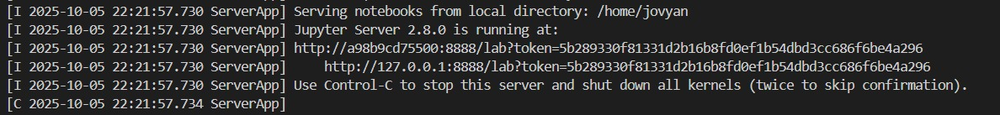
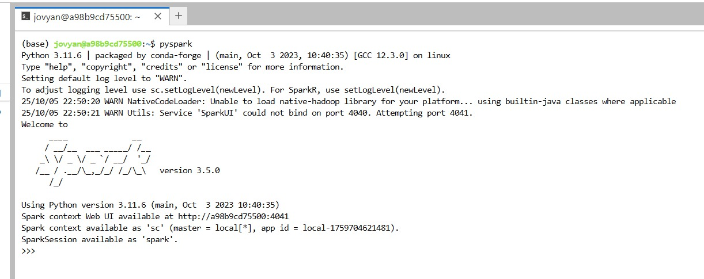
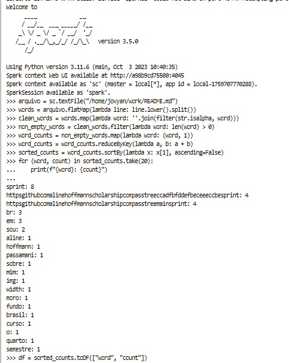
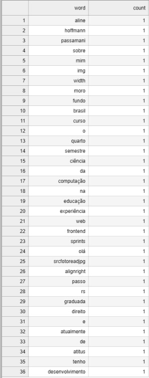
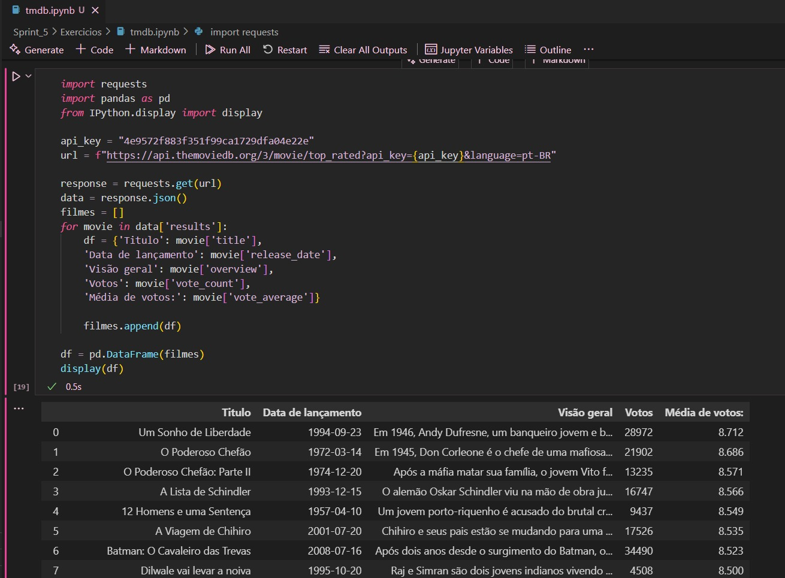

## APACHE SPARK - CONTADOR DE PALAVRAS

Inicialmente, precisei baixar a imagem "jupyter/all-spark-notebook" fornecida pelo exercício. 



Logo após, criei um container a partir da imagem baixada. A inicialização do container gerou um link, dessa forma, colei esse link na barra de endereços do meu navegador e obtive acesso ao Jupyter Lab.



Dentro do Jupyter Lab, no terminal, rodei o comando "pyspark".



Após isso, utilizando o Spark shell, os comandos Spark utilizados para contar a quantidade de ocorrências de cada palavra contida no arquivo "README.md" do meu repositório do Github foram os exibidos a seguir, podendo ser visualizados também [aqui](https://github.com/aline-hoffmann/scholarship-compass/blob/main/Sprint_5/Exercicios/cod-spark.txt).

````
# Ler o arquivo
arquivo = sc.textFile("/home/jovyan/work/README.md")

# Separar palavras
words = arquivo.flatMap(lambda line: line.lower().split())

# Limpar pontuação
clean_words = words.map(lambda word: ''.join(filter(str.isalpha, word)))

# Remover palavras vazias
non_empty_words = clean_words.filter(lambda word: len(word) > 0)

# Contar as palavras
word_counts = non_empty_words.map(lambda word: (word, 1))
word_counts = word_counts.reduceByKey(lambda a, b: a + b)

# Ordenar do mais frequente
sorted_counts = word_counts.sortBy(lambda x: x[1], ascending=False)

# Mostrar as 20 palavras mais comuns
for (word, count) in sorted_counts.take(20):
    print(f"{word}: {count}")

# Salvar todos os resultados em CSV
df = sorted_counts.toDF(["word", "count"])
df.write.csv("/home/jovyan/work/word_counts.csv", header=True)
````

O resultado, salvo em um arquivo CSV, pode ser visualizado [aqui](Sprint_5\Exercicios\resultado-contador.csv).





## TMDB

No segundo exercício, iniciei criando uma conta no portal TMDB, para posteriormente solicitar as chaves de acesso para uso da API.


Depois da conta criada, efetuei o teste com as credenciais e a biblioteca, utilizando o código fornecido pelo exercício.

O teste obteve êxito.

