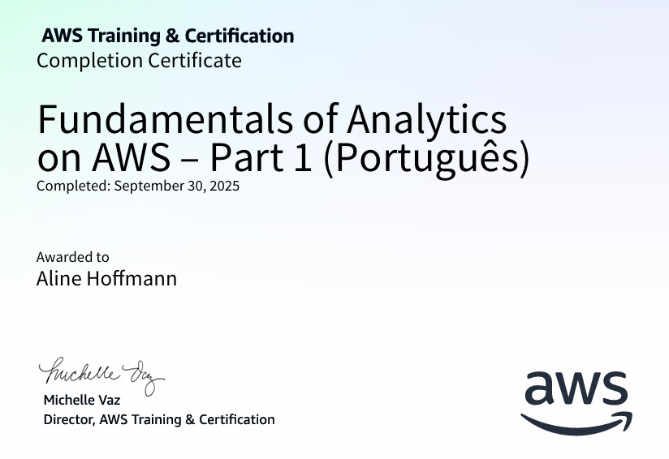
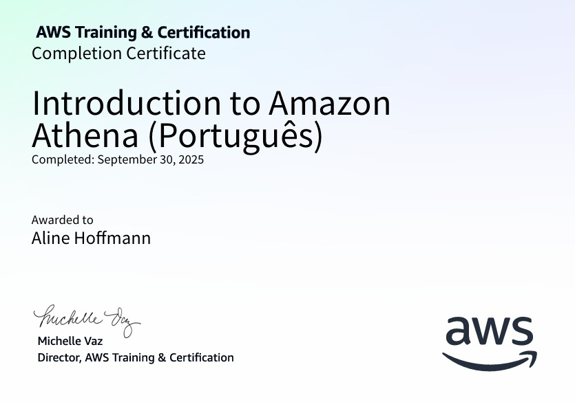
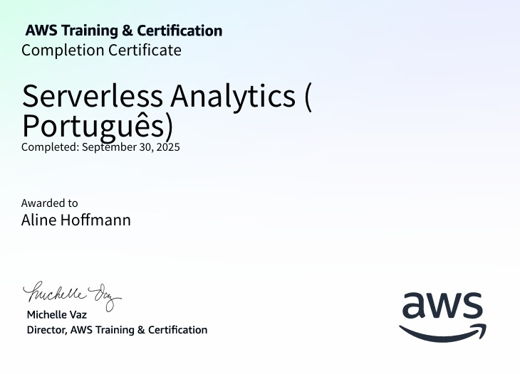

# 📍 SPRINT 5

## Formação Spark com Pyspark

O Apache Spark é uma ferramenta poderosa para processamento de grandes volumes de dados, muito usada por cientistas e engenheiros de dados. Ele permite analisar dados de forma rápida e distribuída, trabalhando com diferentes formatos de arquivos, consultas SQL e até machine learning em larga escala. Por ser rápido, escalável e versátil, o Spark se tornou essencial para tratar grandes volumes de dados.

No curso de PySpark, aprendi a usar o Spark com Python, explorando como trabalhar com diferentes estruturas de dados, realizar consultas, unir informações e otimizar o processamento. Gostei muito de aprender como aplicar essas ferramentas na prática e como o PySpark facilita o trabalho com dados grandes, tornando análises complexas muito mais acessíveis.

## Fundamentals of Analytics on AWS – Part 1

Esse curso apresenta os conceitos básicos de análise de dados e analytics em grandes volumes de dados, incluindo os tipos de análise, os desafios do processamento de dados e os 5 Vs do Big Data. Ele também mostra como esses conceitos se aplicam aos serviços de analytics da AWS, explicando armazenamento, transporte e processamento de dados, além de introduzir ETL, ELT e o uso de ferramentas de business intelligence.

Durante o curso, aprendi sobre machine learning na AWS, diferentes tipos de estruturas e soluções de armazenamento, e como integrar todas essas etapas em pipelines de analytics eficientes. Gostei muito de conhecer como a AWS oferece serviços abrangentes para analisar dados e gerar valor.

## Introduction to Amazon Athena

O curso  apresenta o serviço Amazon Athena, explicando seu funcionamento e o ambiente operacional. Ele ensina as etapas básicas para configurar o Athena, incluindo a criação de bancos de dados e a execução de consultas SQL diretamente pelo Console de Gerenciamento da AWS.

Durante o curso, aprendi como utilizar o Athena para consultar dados de forma rápida e sem a necessidade de gerenciar servidores, tornando mais simples a análise de grandes volumes de dados na nuvem. Gostei de ver na prática como é possível validar informações e explorar dados de maneira eficiente usando este serviço da AWS.

## Serverless Analytics

Esse curso mostra como trabalhar com dados de diferentes fontes e formatos usando ferramentas da AWS sem precisar gerenciar servidores. São apresentados serviços como AWS IoT Analytics, Amazon Cognito, AWS Lambda e Amazon SageMaker, demonstrando como conectar, processar e disponibilizar dados de forma eficiente.

Durante o curso, aprendi a agregar, processar e armazenar dados para gerar insights úteis, aproveitando o poder da arquitetura serverless. Gostei de ver como essas soluções permitem criar pipelines de analytics inovadores e escaláveis, tornando o trabalho com dados mais ágil e flexível na nuvem.

## **[CERTIFICADOS](https://github.com/aline-hoffmann/scholarship-compass/tree/main/Sprint_5/Certificados)**

[Fundamentals of Analytics on AWS – Part 1](https://github.com/aline-hoffmann/scholarship-compass/blob/main/Sprint_5/Certificados/foa-aws-part1.pdf)

 
 

[Introduction to Amazon Athena](https://github.com/aline-hoffmann/scholarship-compass/blob/main/Sprint_5/Certificados/athena-aws.pdf)

 
 

[Serverless Analytics](https://github.com/aline-hoffmann/scholarship-compass/blob/main/Sprint_5/Certificados/serverless-aws.pdf)

## **[EXERCÍCIOS](https://github.com/aline-hoffmann/scholarship-compass/tree/main/Sprint_5/Exercicios)**
 

## [EVIDÊNCIAS](https://github.com/aline-hoffmann/scholarship-compass/tree/main/Sprint_5/Evidencias)**
 

## **DESAFIO**