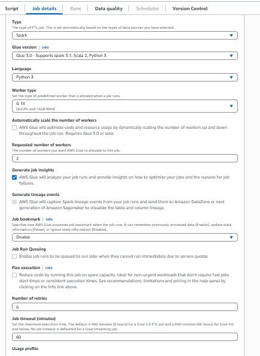
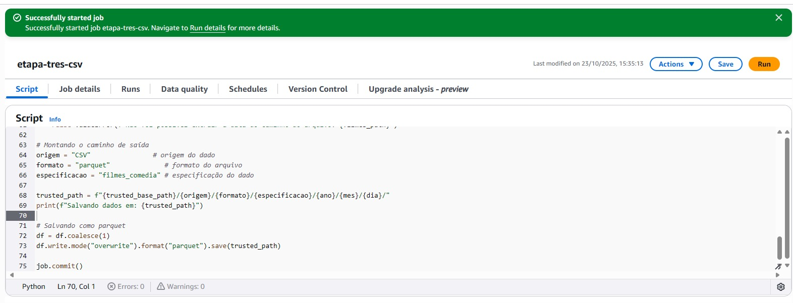
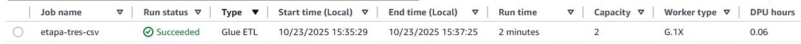
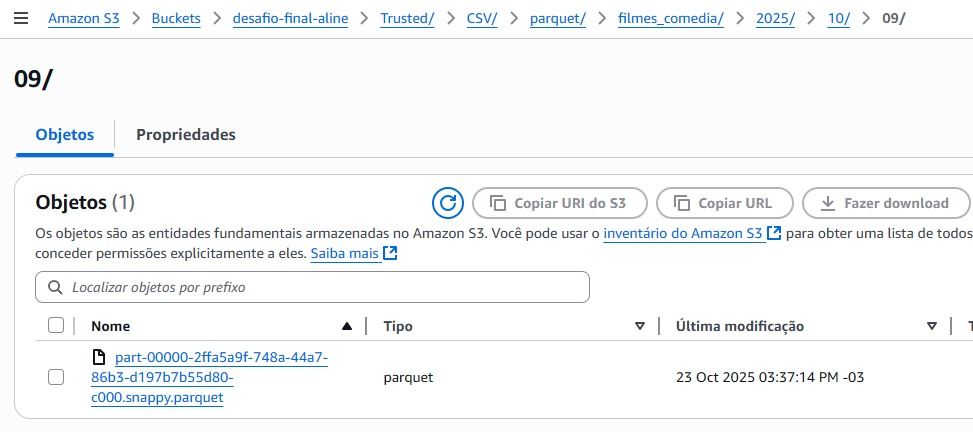
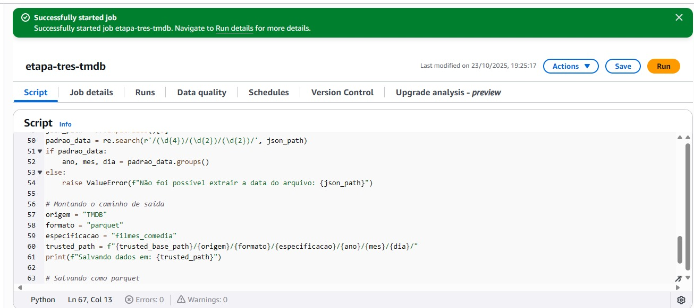
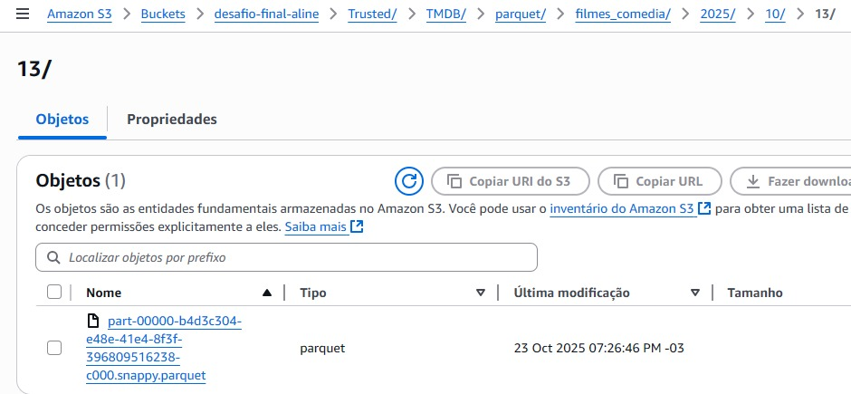

# DESAFIO

O desafio da Sprint 6 corresponde à etapa 3 do desafio final de criação do Data Lake. Nessa etapa, eu desenvolvi o processamento da camada Trusted, responsável por armazenar os dados já limpos, tratados e confiáveis.

Para isso, utilizei o Apache Spark por meio do serviço AWS Glue, realizando a leitura dos arquivos CSV e JSON que estavam na camada Raw e transformando-os em arquivos Parquet. Dessa forma, os dados ficaram padronizados, otimizados para consulta e prontos para serem analisados posteriormente com o AWS Athena, utilizando consultas SQL.


## JOB CSV

Primeiramente criei o Job para o arquivo CSV, configurando todas as opções necessárias pra que ele rodasse corretamente. Dei o nome “etapa-tres-csv” e usei o IAM Role já criado no laboratório do Glue dessa sprint.

Defini o tipo do job como Spark, na versão 3.0 do Glue, com Worker Type G.1x, 2 workers, e um tempo limite de 60 minutos. Também desabilitei a opção Spark UI, conforme as instruções dadas no desafio.



### SCRIPT JOB CSV

Iniciei fazendo as importações necessárias, como awsglue e pyspark.sql.functions, que fornecem as funções principais para manipular os dados, além de datetime e re, usadas para lidar com datas e extrair informações do caminho de origem no S3.

````
import sys
import re
from awsglue.utils import getResolvedOptions
from pyspark.context import SparkContext
from awsglue.context import GlueContext
from awsglue.job import Job
from pyspark.sql import functions as F
````

Em seguida, defini os paramêtros do job e fiz a inicialização do Glue e do Spark, criando o SparkContext e o GlueContext. Isso permite que o job utilize as funcionalidades do Spark para processar os dados em larga escala.

````
args = getResolvedOptions(sys.argv, ['JOB_NAME', 'RAW_PATH', 'TRUSTED_BASE_PATH'])

sc = SparkContext()
glueContext = GlueContext(sc)
spark = glueContext.spark_session
job = Job(glueContext)
job.init(args['JOB_NAME'], args)

raw_path = args['RAW_PATH']
trusted_base_path = args['TRUSTED_BASE_PATH']
````

Ademais, fiz a leitura do meu arquivo CSV localizado na camada Raw, usando as opções header=True e sep="|", já que o delimitador do arquivo era o caractere pipe (|).

````
f = spark.read.option("header", True).option("sep", "|").csv(raw_path)
````

Após a leitura do arquivo, eu realizei a limpeza e padronização dos dados. Primeiro, removi as linhas duplicadas utilizando o método dropDuplicates(). 

Em seguida, removi espaços extras de todas as colunas do tipo texto com a função trim(). Também converti os valores de algumas colunas, como tituloPrincipal, tituloOriginal e genero, para letras maiúsculas, garantindo uma padronização nos textos. 

As colunas numéricas, como anoLancamento, notaMedia e tempoMinutos, foram convertidas para o tipo double para permitir operações numéricas de forma correta. 

Por fim, filtrei apenas os registros de filmes cujo gênero contém o termo “COMEDY”, mantendo no dataset apenas os filmes de comédia.

````
df = df.dropDuplicates() 

for c in df.columns:
    df = df.withColumn(c, F.when(F.col(c).isNotNull(), F.trim(F.col(c))).otherwise(F.col(c)))

colunas_texto = [
    'tituloPincipal', 'tituloOriginal', 'genero',
    'generoArtista', 'personagem', 'nomeArtista',
    'profissao', 'titulosMaisConhecidos'
]
for c in colunas_texto:
    if c in df.columns:
        df = df.withColumn(c, F.upper(F.col(c)))

colunas_numericas = ['anoLancamento', 'tempoMinutos', 'notaMedia', 'numeroVotos']
for c in colunas_numericas:
    if c in df.columns:
        df = df.withColumn(c, F.col(c).cast("double"))

df = df.filter(F.col("genero").contains("COMEDY"))
````

Além disso, extraí a data de ingestão diretamente do caminho de origem no S3, dentro da camada Raw (no formato ano/mes/dia) e utilizei essa informação para montar dinamicamente o caminho de destino na camada Trusted, mantendo a mesma estrutura temporal dos arquivos originais.

````
filmes_path = df.inputFiles()[0] 

padrao_data = re.search(r'/(\d{4})/(\d{2})/(\d{2})/', filmes_path)
if padrao_data:
    ano, mes, dia = padrao_data.groups()
else:
    raise ValueError(f"Não foi possível extrair a data do caminho do arquivo: {filmes_path}")
````

Depois, montei o caminho de saída, considerando o padrão solicitado e salvei como parquet.

````
origem = "CSV"                # origem do dado
formato = "parquet"              # formato do arquivo
especificacao = "filmes_comedia" # especificação do dado

trusted_path = f"{trusted_base_path}/{origem}/{formato}/{especificacao}/{ano}/{mes}/{dia}/"
print(f"Salvando dados em: {trusted_path}")

df = df.coalesce(1)
df.write.mode("overwrite").format("parquet").save(trusted_path)

job.commit()
````

### EXECUÇÃO DO JOB CSV

Após finalizar o script, salvei e executei o job no AWS Glue. 



O job foi executado com sucesso, salvando o parquet no caminho correto.





<br>

## JOB TMDB

Para essa etapa, eu configurei um Job para processar os arquivos JSON, garantindo que todas as configurações necessárias para execução estivessem corretas. O job recebeu o nome “etapa-tres-tmdb” e utilizei o IAM Role que já havia sido criado durante o laboratório do Glue desta sprint.

O tipo do job foi definido como Spark, na versão 3.0 do Glue, com Worker Type G.1X, 2 workers, e limite de execução de 60 minutos. Também desativei o Spark UI, as mesma forma do Job CSV.

### SCRIPT JOB TMDB

Comecei importando as bibliotecas necessárias, como awsglue e pyspark.sql.functions, que fornecem funções para manipulação de dados, além de re, usada para capturar informações do caminho no S3.

````
import sys
import re
from awsglue.utils import getResolvedOptions
from pyspark.context import SparkContext
from awsglue.context import GlueContext
from awsglue.job import Job
from pyspark.sql import functions as F
````

Em seguida, defini os parâmetros do job e inicializei o Glue e o Spark, criando o SparkContext e o GlueContext, permitindo utilizar os recursos do Spark para processar os dados de forma distribuída.

````
args = getResolvedOptions(sys.argv, ['JOB_NAME', 'RAW_PATH', 'TRUSTED_BASE_PATH'])

sc = SparkContext()
glueContext = GlueContext(sc)
spark = glueContext.spark_session
job = Job(glueContext)
job.init(args['JOB_NAME'], args)

raw_path = args['RAW_PATH']
trusted_base_path = args['TRUSTED_BASE_PATH']
````

Depois, realizei a leitura de todos os arquivos JSON presentes na pasta da camada Raw, usando a opção multiline=True para arquivos que estejam no formato array de objetos.

````
df = spark.read.option("multiline", True).json(raw_path)
````

Com os dados carregados, passei para a limpeza e padronização. Removi linhas duplicadas com dropDuplicates(), eliminei espaços extras de colunas do tipo texto utilizando trim(), e converti as colunas de texto, como title, original_title, genero e tipo, para maiúsculas, garantindo uniformidade. As colunas numéricas, como vote_average, vote_count, popularity e id, foram convertidas para double, permitindo cálculos corretos.


````
df = df.dropDuplicates()

for c, dtype in df.dtypes:
    if dtype in ['string', 'boolean']:
        df = df.withColumn(c, F.when(F.col(c).isNotNull(), F.trim(F.col(c).cast("string"))).otherwise(None))

colunas_texto = ['title', 'original_title', 'genero', 'tipo']
for c in colunas_texto:
    if c in df.columns:
        df = df.withColumn(c, F.upper(F.col(c)))

colunas_numericas = ['vote_average', 'vote_count', 'popularity', 'id']
for c in colunas_numericas:
    if c in df.columns:
        df = df.withColumn(c, F.col(c).cast("double"))
````

Em seguida, capturei a data de ingestão diretamente do caminho do S3, que estava no formato ano/mes/dia, para criar dinamicamente o diretório de saída na camada Trusted.

````
json_path = df.inputFiles()[0]
padrao_data = re.search(r'/(\d{4})/(\d{2})/(\d{2})/', json_path)
if padrao_data:
    ano, mes, dia = padrao_data.groups()
else:
    raise ValueError(f"Não foi possível extrair a data do arquivo: {json_path}")
````

Por fim, montei o caminho final de saída e escrevi os dados no formato Parquet. Usei coalesce(1) para gerar apenas um único arquivo, e mode("overwrite") para garantir que qualquer conteúdo existente fosse substituído.

````
origem = "TMDB"
formato = "parquet"
especificacao = "filmes_comedia"
trusted_path = f"{trusted_base_path}/{origem}/{formato}/{especificacao}/{ano}/{mes}/{dia}/"
print(f"Salvando dados em: {trusted_path}")

df = df.coalesce(1)
df.write.mode("overwrite").format("parquet").save(trusted_path)

job.commit()
````

### EXECUÇÃO DO JOB TMDB

Após salvar o script, executei o job no AWS Glue.



O job foi concluído com sucesso, salvando o arquivo Parquet no caminho correto, organizado conforme a estrutura solicitada.


