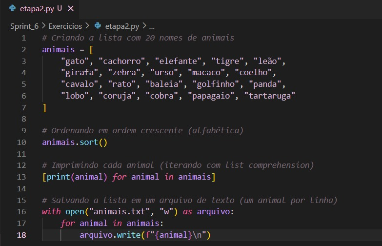
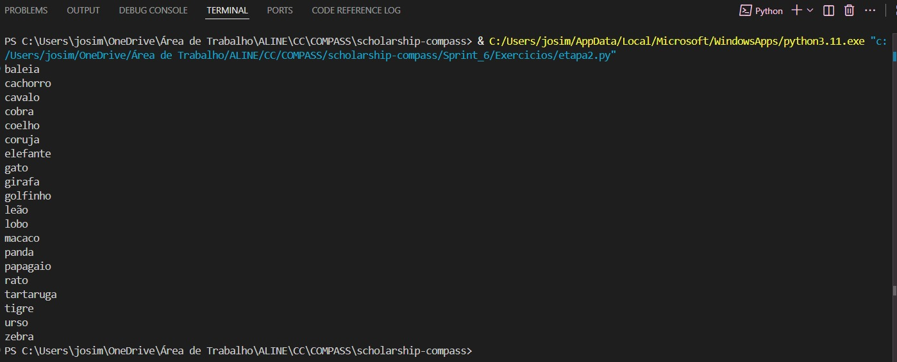

# PARTE 1.

## ETAPA 1
Comecei declarando e inicializando a lista com 250 números inteiros, obtidos de forma aleatória. Delimitei do 1 até o 2000.

````
numeros = [random.randint(1, 2000) for _ in range(250)]
````

Depois, inverti a ordem da lista utilizando o método "reverse", conforme solicitado.

````
numeros.reverse()
````

Por fim, imprimi o resultado.

````
print(numeros)
````

O código completo e o resultado impresso foram:


<br>

## ETAPA 2

Iniciei declarando e inicializando a lista com o nome de 20 animais.

````
animais = [
    "gato", "cachorro", "elefante", "tigre", "leão",
    "girafa", "zebra", "urso", "macaco", "coelho",
    "cavalo", "rato", "baleia", "golfinho", "panda",
    "lobo", "coruja", "cobra", "papagaio", "tartaruga"
]
````

Logo após, ordenei a lista em ordem crescente (ordem alfabética).

````
# Ordenando em ordem crescente (alfabética)
animais.sort()
````

Ademais, iterei sobre os itens utilizando o list comprehensior e imprimi um a um.

````
[print(animal) for animal in animais]
````

Por fim, armazenei o conteúdo da lista em um arquivo txt, com um item em cada linha, conforme solicitado.

````
with open("animais.txt", "w") as arquivo:
    for animal in animais:
        arquivo.write(f"{animal}\n")
````

O código completo e o resultado impresso foram:





O arquivo txt gerado pode ser visualizado [aqui](https://github.com/aline-hoffmann/scholarship-compass/blob/main/Sprint_6/Exercicios/animais.txt).

## ETAPA 3

Iniciei instalando a biblioteca "names", pelo terminal.

````
pip install names
````


Após isso, importei as bibiotecas solicitadas.

````
import random
import time
import os
import names
````

Depois, defini os parâmetros para a geração do dataset, ou seja, a quantidade de nomes aleatórios e a quantidades de nomes, que deviam ser únicos. Defini também a semente da aleatoriedade.

````
random.seed(40)
qtd_nomes_unicos = 39080
qtd_nomes_aleatorios = 1000000
````

Ademais, gerei os nomes aleatórios através do código fornecido.

````
aux=[]
for i in range(0, qtd_nomes_unicos):
    aux.append(names.get_full_name())

print(f'Gerando {qtd_nomes_aleatorios} nomes aleatórios')

dados=[]
for i in range(0, qtd_nomes_aleatorios):
    dados.append(random.choice(aux))
````

Por fim, gerei um aquivo txt "nomes_aleatorios" com todos os nomes, um a cada linha.

````
with open("nomes_aleatorios.txt", "w", encoding="utf-8") as arquivo:
    for nome in dados:
        arquivo.write(f"{nome}\n")
````

O arquivo "nomes_aleatorios.txt" pode ser consultado [aqui] LINK DO GITHUB!!!!!!!!!!1