# PARTE 1.

## ETAPA 1
Comecei declarando e inicializando a lista com 250 números inteiros, obtidos de forma aleatória. Delimitei do 1 até o 2000.

````
numeros = [random.randint(1, 2000) for _ in range(250)]
````

Depois, inverti a ordem da lista utilizando o método "reverse", conforme solicitado.

````
numeros.reverse()
````

Por fim, imprimi o resultado.

````
print(numeros)
````

O código completo e o resultado impresso foram:

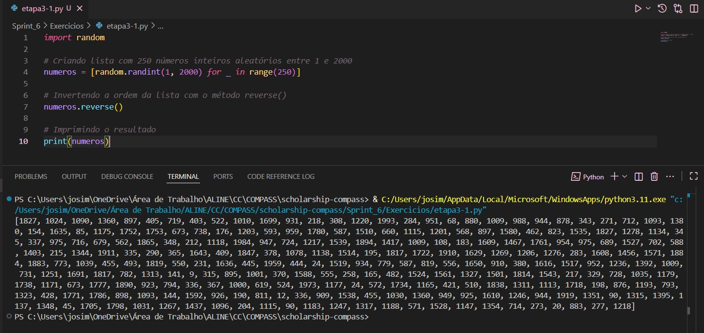
<br>

## ETAPA 2

Iniciei declarando e inicializando a lista com o nome de 20 animais.

````
animais = [
    "gato", "cachorro", "elefante", "tigre", "leão",
    "girafa", "zebra", "urso", "macaco", "coelho",
    "cavalo", "rato", "baleia", "golfinho", "panda",
    "lobo", "coruja", "cobra", "papagaio", "tartaruga"
]
````

Logo após, ordenei a lista em ordem crescente (ordem alfabética).

````
# Ordenando em ordem crescente (alfabética)
animais.sort()
````

Ademais, iterei sobre os itens utilizando o list comprehensior e imprimi um a um.

````
[print(animal) for animal in animais]
````

Por fim, armazenei o conteúdo da lista em um arquivo txt, com um item em cada linha, conforme solicitado.

````
with open("animais.txt", "w") as arquivo:
    for animal in animais:
        arquivo.write(f"{animal}\n")
````

O código completo e o resultado impresso foram:


O arquivo txt gerado pode ser visualizado [aqui](https://github.com/aline-hoffmann/scholarship-compass/blob/main/Sprint_6/Exercicios/parte1/animais.txt). 

## ETAPA 3

Iniciei instalando a biblioteca "names", pelo terminal.

````
pip install names
````

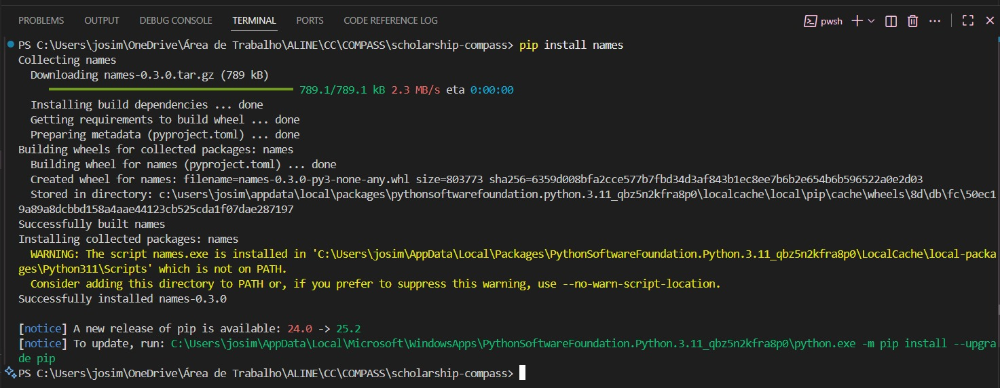

Após isso, importei as bibiotecas solicitadas.

````
import random
import time
import os
import names
````

Depois, defini os parâmetros para a geração do dataset, ou seja, a quantidade de nomes aleatórios e a quantidades de nomes, que deviam ser únicos. Defini também a semente da aleatoriedade.

````
random.seed(40)
qtd_nomes_unicos = 39080
qtd_nomes_aleatorios = 10000000
````

Ademais, gerei os nomes aleatórios através do código fornecido.

````
aux=[]
for i in range(0, qtd_nomes_unicos):
    aux.append(names.get_full_name())

print(f'Gerando {qtd_nomes_aleatorios} nomes aleatórios')

dados=[]
for i in range(0, qtd_nomes_aleatorios):
    dados.append(random.choice(aux))
````

Por fim, gerei um aquivo txt "nomes_aleatorios" com todos os nomes, um a cada linha.

````
with open("nomes_aleatorios.txt", "w", encoding="utf-8") as arquivo:
    for nome in dados:
        arquivo.write(f"{nome}\n")
````

Devido ao tamanho, não enviei o arquivo "nomes_aleatorios.txt" para o GitHub.

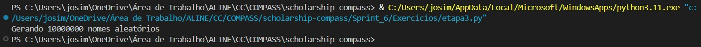

<br>

# PARTE 2.

## ETAPA 1
Antes de executar o script python, realizei os primeiros testes com o jupyter notebook.

Iniciei preparando o ambiente, importando as bibliotecas necessárias.

````
from pyspark.sql import SparkSession
from pyspark import SparkContext, SQLContext
````

Após isso, defini a Apark Session e o Context para habilitar o módulo SQL. Também li o arquivo "nomes_aleatórios.txt", carregando-o dentro de um dataframe chamado "df_nomes".

````
spark = SparkSession \
    .builder \
    .master("local[*]") \
    .appName("Exercicio Intro") \
    .getOrCreate()

df_nomes = spark.read.csv("nomes_aleatorios.txt")
df_nomes.show(5)
````

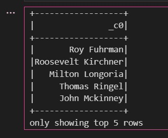

## ETAPA 2

Na Etapa 2, eu renomeei a coluna padrão _c0, que o Spark criou automaticamente ao ler o arquivo, para “Nomes”, deixando o DataFrame mais organizado e fácil de entender.

Depois usei o método printSchema() para verificar o tipo das colunas e o show(10) para visualizar as 10 primeiras linhas e conferir se a leitura e a renomeação estavam corretas.

````
# Renomeando a coluna _c0 para Nomes
df_nomes = df_nomes.withColumnRenamed("_c0", "Nomes")

# Exibindo o schema
df_nomes.printSchema()

# Mostrando as 10 primeiras linhas
df_nomes.show(10)
````

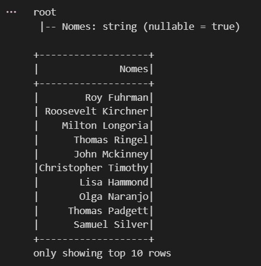

## ETAPA 3

Na Etapa 3, eu criei a coluna “Escolaridade” usando o método withColumn() e as funções F.rand() e F.when() do Spark.
O F.rand() gera um número aleatório para cada linha, e com o F.when() defini faixas de valores que atribuem aleatoriamente “Fundamental”, “Médio” ou “Superior” a cada registro.

Por fim, usei o show(10) para visualizar as primeiras linhas e confirmar que a nova coluna foi criada corretamente.

````
from pyspark.sql import functions as F

df_nomes = df_nomes.withColumn(
    "Escolaridade",
    F.when(F.rand() < 1/3, "Fundamental")
     .when(F.rand() < 2/3, "Médio")
     .otherwise("Superior")
)

df_nomes.show(10)
````

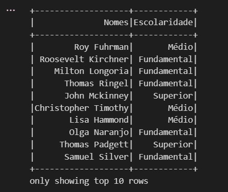

## ETAPA 4

Na Etapa 4, eu adicionei a coluna “Pais” ao DataFrame usando o método withColumn() junto com as funções F.rand() e F.when() do Spark.

O F.rand() gera um número aleatório para cada linha, e com o F.when() defini intervalos que atribuem aleatoriamente um país da América do Sul a cada registro, como Brasil, Argentina, Chile, entre outros.

Por fim, usei o show(10) para conferir se a coluna foi criada corretamente.

````
df_nomes = df_nomes.withColumn(
    "Pais",
    F.when(F.rand() < 1/13, "Brasil")
     .when(F.rand() < 2/13, "Argentina")
     .when(F.rand() < 3/13, "Chile")
     .when(F.rand() < 4/13, "Uruguai")
     .when(F.rand() < 5/13, "Paraguai")
     .when(F.rand() < 6/13, "Bolívia")
     .when(F.rand() < 7/13, "Peru")
     .when(F.rand() < 8/13, "Equador")
     .when(F.rand() < 9/13, "Colômbia")
     .when(F.rand() < 10/13, "Venezuela")
     .when(F.rand() < 11/13, "Guiana")
     .when(F.rand() < 12/13, "Suriname")
     .otherwise("Guiana Francesa")
)

df_nomes.show(10)
````

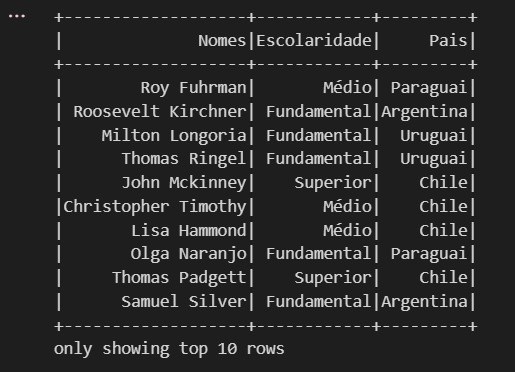

## ETAPA 5

Na etapa 5, eu adicionei uma coluna chamada AnoNascimento com um valor aleatório entre 1945 e 2010 para cada pessoa.

Usei o F.rand() do Spark, que gera números entre 0 e 1, multipliquei pelo intervalo de anos e somei 1945 para garantir que os anos fiquem dentro do intervalo desejado.

````
df_nomes = df_nomes.withColumn(
    "AnoNascimento",
    (F.floor(F.rand() * (2010 - 1945 + 1)) + 1945).cast("int")
)

df_nomes.show(10)
````

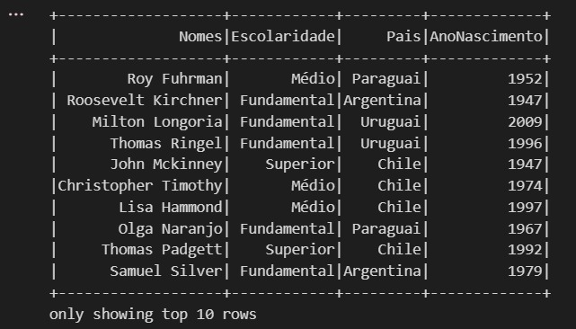

## ETAPA 6

Nessa etapa filtrei apenas as pessoas nascidas a partir do ano 2000 usando a API do DataFrame.

Depois usei o .show(10) para exibir as 10 primeiras linhas e dar uma olhada rápida nos resultados.

````
df_select = df_nomes.select("*").where(F.col("AnoNascimento") >= 2000)
df_select.show(10)
````

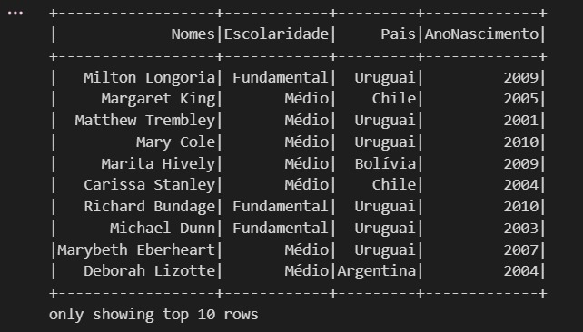

## ETAPA 7

Na etapa 7 ralizei a mesma filtragem da etapa 6, mas usando SQL do Spark.

Criei uma view temporária chamada "pessoas" e rodei a query SQL para pegar quem nasceu a partir de 2000.

````
df_nomes.createOrReplaceTempView("pessoas")

df_select_sql = spark.sql("""
    SELECT * FROM pessoas
    WHERE AnoNascimento >= 2000
""")
````

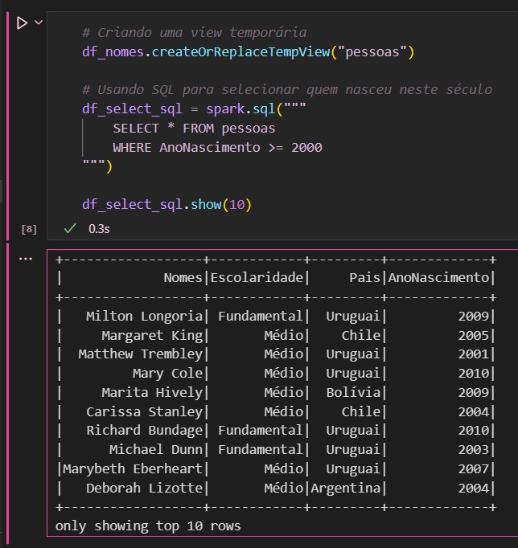

## ETAPA 8

Para a etapa 8 eu filtrei os anos entre 1980 e 1994 (Millennials) e contei quantas pessoas se encaixam nesse intervalo.

Usei a API de DataFrame do Spark, que é direta e eficiente.

````
df_millennials = df_nomes.filter(
    (F.col("AnoNascimento") >= 1980) & (F.col("AnoNascimento") <= 1994)
)

print("Número de Millennials:", df_millennials.count())
````

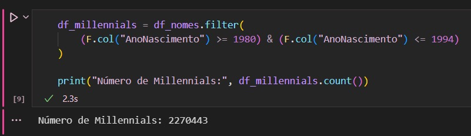

## ETAPA 9

Nessa etapa eu repeti a contagem da etapa 8 usando SQL.

Dessa forma, pude comparar e ver que o Spark permite fazer a mesma análise de forma declarativa.

````
df_millennials_sql = spark.sql("""
    SELECT COUNT(*) AS Qntd_millennials
    FROM pessoas
    WHERE AnoNascimento BETWEEN 1980 AND 1994
""")

df_millennials_sql.show()
````

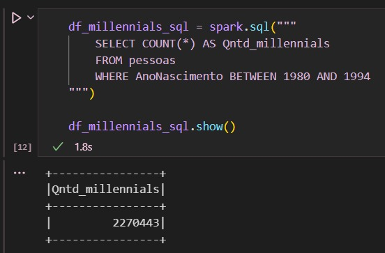

## ETAPA 10

Na última etapa, classifiquei cada pessoa em uma geração (Baby Boomers, Geração X, Millennials, Geração Z) de acordo com o ano de nascimento.

Depois contei quantas pessoas de cada geração existem por país, usando SQL para agrupar e ordenar os resultados.

Por fim, usei .show(52) para visualizar os registros e ter uma visão geral dos dados agrupados.

````
df_geracoes = spark.sql("""
    SELECT
        Pais,
        CASE
            WHEN AnoNascimento BETWEEN 1944 AND 1964 THEN 'Baby Boomers'
            WHEN AnoNascimento BETWEEN 1965 AND 1979 THEN 'Geração X'
            WHEN AnoNascimento BETWEEN 1980 AND 1994 THEN 'Millennials'
            WHEN AnoNascimento BETWEEN 1995 AND 2015 THEN 'Geração Z'
            ELSE 'Outra'
        END AS Geracao,
        COUNT(*) AS Quantidade
    FROM pessoas
    GROUP BY Pais, Geracao
    ORDER BY Pais ASC, Geracao ASC, Quantidade ASC
""")

df_geracoes.show(52)
````

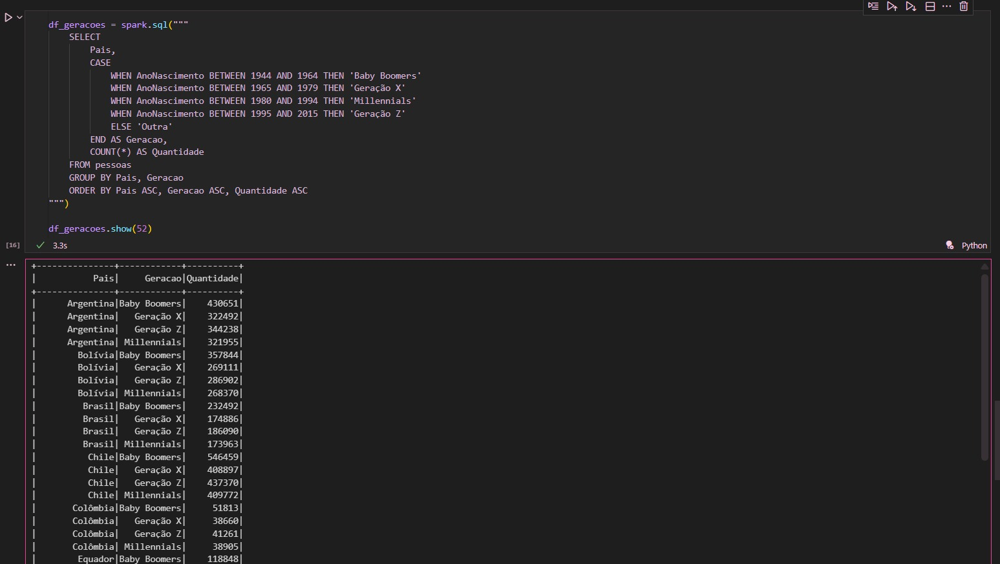

<br>

O arquivo .ipynb pode ser visualizado [aqui](https://github.com/aline-hoffmann/scholarship-compass/blob/main/Sprint_6/Exercicios/parte2/parte2.ipynb). Já o script python pode ser acessado [aqui](https://github.com/aline-hoffmann/scholarship-compass/blob/main/Sprint_6/Exercicios/parte2/parte2.py).