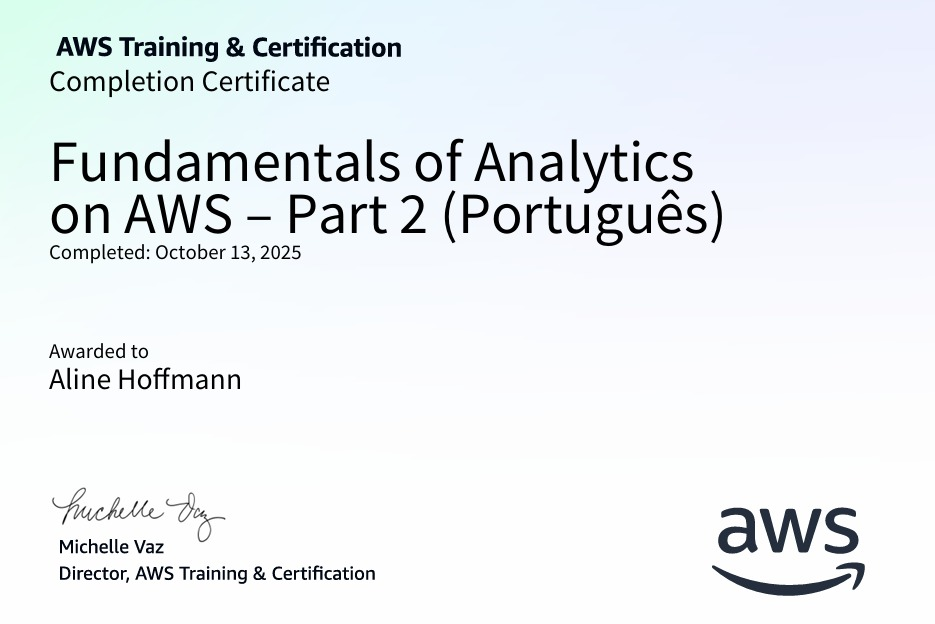
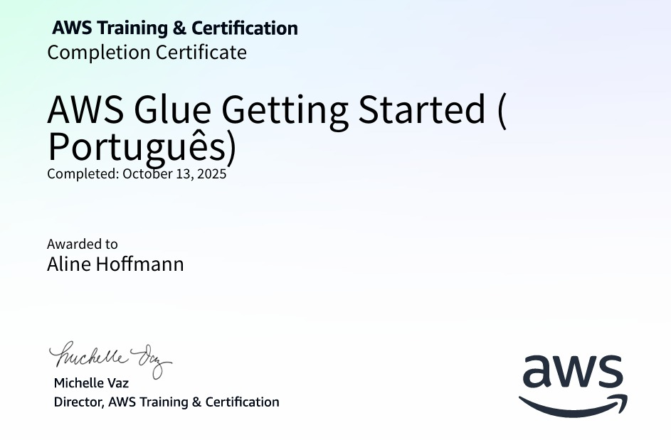

# 📍 **SPRINT 6**

## Fundamentals of Analytics on AWS – Part 2

Neste curso, aprendi os fundamentos da arquitetura de dados moderna, incluindo as tecnologias de data lakes e data warehouses. Estudei os benefícios, recursos e arquiteturas básicas de cada um, bem como os serviços da AWS que permitem criá-los e gerenciá-los, como o AWS Lake Formation para data lakes e o Amazon Redshift para data warehouses. Também explorei os principais desafios de governança, qualidade de dados e segurança, e como as soluções da AWS ajudam a superá-los, garantindo eficiência e confiabilidade no armazenamento e análise de dados.

Além disso, aprendi sobre os pilares da arquitetura de dados moderna — data lakes escaláveis, serviços de analytics com propósito específico, acesso unificado a dados, governança unificada e desempenho econômico — e conceitos importantes como movimentação de dados, arquitetura de malha de dados e dados como produto, incluindo o uso do Amazon DataZone para governança central. Também analisei casos de uso de analytics em diferentes setores e as arquiteturas modernas de referência na AWS, entendendo o pipeline de analytics, os estágios de processamento e os serviços aplicáveis em cada etapa.

## AWS Glue Getting Started

Durante este curso aprendi a utilizar o AWS Glue, um serviço de integração de dados sem servidor, para descobrir, preparar e combinar dados visando análises, machine learning e desenvolvimento de aplicações. Estudei seus benefícios, casos de uso mais comuns e conceitos técnicos, incluindo o AWS Glue Studio para criação e monitoramento de tarefas ETL e o AWS Glue DataBrew, uma ferramenta visual que permite limpar, normalizar e preparar dados sem necessidade de código. Também explorei como o serviço se integra com o Amazon S3 e como experimentar o AWS Glue e o DataBrew diretamente pelo Console de Gerenciamento da AWS.

Ademais, aprendi sobre os requisitos para implementar o AWS Glue e o DataBrew em cenários reais, reconhecendo os benefícios de acelerar processos de ETL e reduzir o tempo de desenvolvimento. O curso abordou a estrutura de custos do AWS Glue e forneceu experiências práticas por meio de demonstrações, permitindo compreender melhor como preparar dados para análises e machine learning de forma eficiente e automatizada.

## Tutoriais técnicos

Nos tutoriais da AWS LATAM, aprendi a construir um fluxo completo de análise de dados usando os serviços da AWS. O conteúdo mostrou como preparar e organizar dados com o AWS Glue, consultá-los com o AWS Athena e criar visualizações no Amazon QuickSight. Essa abordagem me ajudou a entender de forma prática como integrar diferentes ferramentas da nuvem, transformando dados brutos em informações úteis.

 

## **[CERTIFICADOS](https://github.com/aline-hoffmann/scholarship-compass/tree/main/Sprint_6/Certificados)**

### [Fundamentals of Analytics on AWS – Part 2](https://github.com/aline-hoffmann/scholarship-compass/blob/main/Sprint_6/Certificados/cert-foa-aws-part2.pdf)

### [AWS Glue Getting Started](https://github.com/aline-hoffmann/scholarship-compass/blob/main/Sprint_6/Certificados/cert-foa-aws-part2.pdf)

 

## **[EXERCÍCIOS](https://github.com/aline-hoffmann/scholarship-compass/tree/main/Sprint_6/Exercicios)**
 

## **[EVIDÊNCIAS](https://github.com/aline-hoffmann/scholarship-compass/tree/main/Sprint_6/Evidenciass)**
 

## **DESAFIO**

O desafio da Sprint 6 correspondia à etapa 3 do desafio final. Nessa fase, foi desenvolvido o processamento da camada Trusted, responsável por armazenar os dados já limpos, tratados e confiáveis. Para isso, utilizei o Apache Spark por meio do AWS Glue, realizando a leitura dos arquivos CSV e JSON da camada Raw, aplicando transformações e salvando os resultados em formato Parquet.

Essa etapa garantiu que os dados ficassem padronizados e otimizados para consultas posteriores no AWS Athena, servindo como base para análises e visualizações futuras.

Todos os passos e códigos utilizados para a execução do desafio podem ser visualizados [aqui.](https://github.com/aline-hoffmann/scholarship-compass/tree/main/Sprint_6/Desafio)