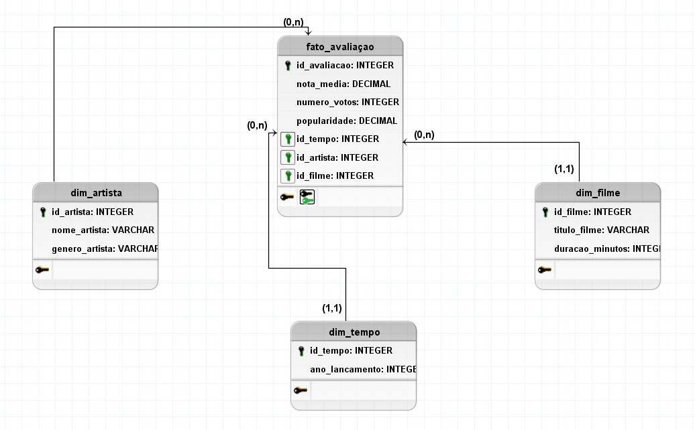
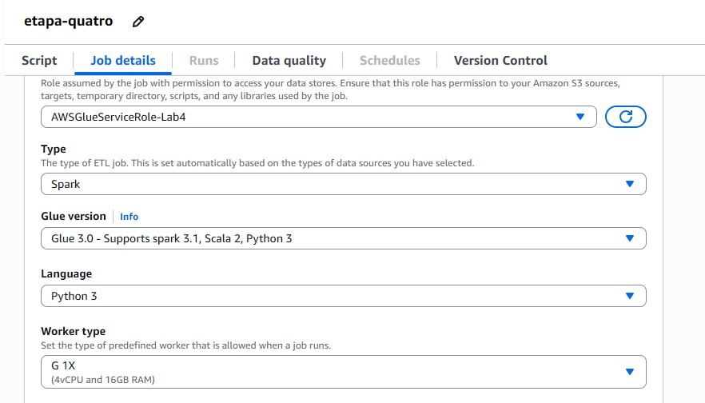
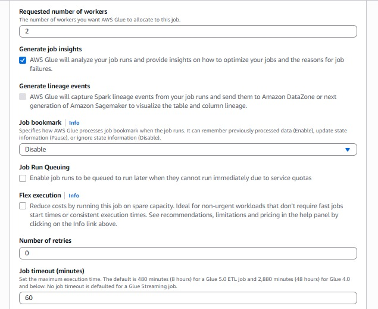
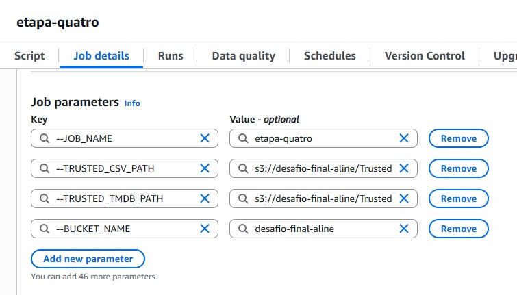
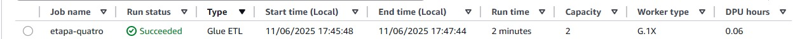
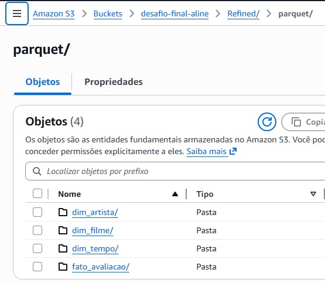
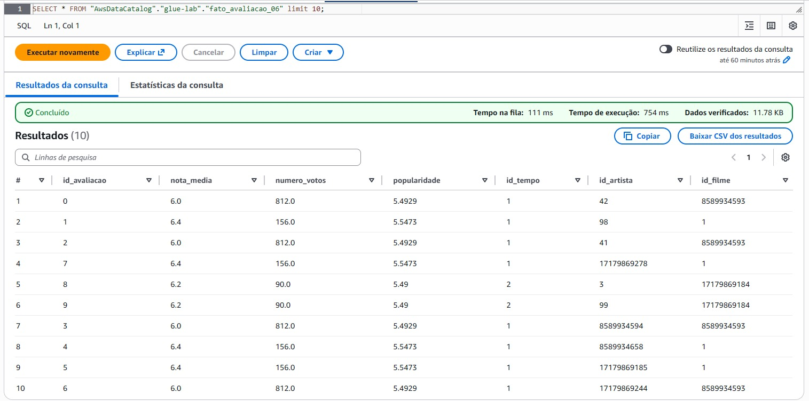
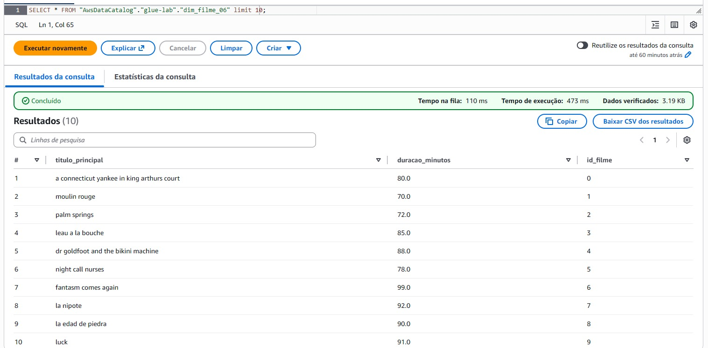
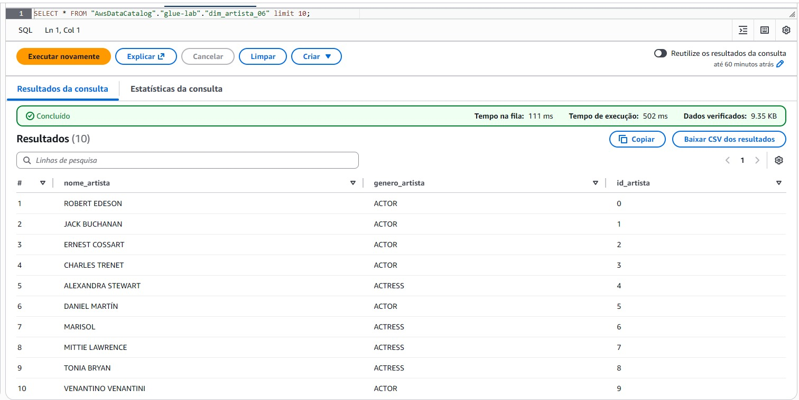

# DESAFIO

O desafio dessa sprint foi criar e modelar a camada Refined do Data Lake, garantindo que os dados estejam prontos para análise e extração de insights. Para isso, utilizei uma abordagem multidimensional na modelagem, desenhando as tabelas de acordo com as perguntas que pretendo responder, e organizei tudo com base nos dados provenientes da camada Trusted.

Depois de definir o modelo, utilizei o AWS Glue para processar e transformar esses dados, estruturando tudo conforme a modelagem criada. Os dados finais foram armazenados na camada Refined no formato PARQUET, já otimizados para visualização e consultas futuras.

<br>

## MODELAGEM DE DADOS

Para iniciar a resolução do desafio, organizei os dados da camada Trusted seguindo um modelo em estrela (Star Schema). 

Meu objetivo nessa modelagem foi levar apenas as informações necessárias para responder meus questionamentos, definidos nas sprints anteriores.

Para isso, eu criei uma tabela fato, que concentra as métricas principais, e três dimensões, que armazenam os dados descritivos.

Na tabela fato (fato_avaliação) coloquei informações sobre as avalições dos filmes, como nota média, número de votos e popularidade. Além disso, ela se relaciona com as dimensões de filme, artista e tempo por meio das chaves estrangeiras (id_filme, id_artista, id_tempo).

Quanto às dimensões, criei três, sendo: dim_filme, dim_artista e dim_tempo. A dimensão de filme armazena dados como o título e a duração dos filmes, permitindo observar características e tendências ao longo do tempo. 

A dimensão de artista reúne o nome e o gênero dos artistas, o que possibilita comparar médias de avaliação entre homens e mulheres e identificar os artistas mais recorrentes nas comédias. 

Já a dimensão de tempo organiza os dados por ano de lançamento, servindo de base para analisar a evolução das produções e o comportamento da duração dos filmes ao longo dos anos.

<br>



<br>

Com essa modelagem, estruturei a camada Refined de forma mais analítica, levando apenas os dados realmente úteis para as minhas análises.

<br>

## PROCESSAMENTO CAMADA REFINED

Para aplicar a minha modelagem na prática, criei um novo job chamado de "etapa-quatro". Configurei o job conforme as orientações do desafio.







Depois de configurado o job, alterei o script padrão que costuma vir com ele.

Iniciei importando as bibliotecas necessárias: sys para argumentos do sistema, datetime para lidar com datas, e unicodedata para normalizar textos. Também trouxe os módulos do AWS Glue e do Spark.

````
import sys
import datetime
import unicodedata
from awsglue.utils import getResolvedOptions
from pyspark.context import SparkContext
from awsglue.context import GlueContext
from awsglue.job import Job
from pyspark.sql import functions as F
from pyspark.sql.types import StringType
````

Na sequência, defini os parâmetros do job, como nome, bucket e caminhos dos arquivos trusted para CSV e TMDB. Também já preparei o caminho de destino da camada Refined, organizando tudo no padrão de diretórios do S3. 

````
args = getResolvedOptions(sys.argv, [
    "JOB_NAME",
    "BUCKET_NAME",
    "TRUSTED_CSV_PATH",
    "TRUSTED_TMDB_PATH"
])

bucket = args["BUCKET_NAME"]
trusted_csv_path = args["TRUSTED_CSV_PATH"]
trusted_tmdb_path = args["TRUSTED_TMDB_PATH"]

refined_base_path = f"s3://{bucket}/Refined/parquet/"
````

Ademais, inicializei o SparkContext e o GlueContext, além do job do Glue, o que permite que o processamento aconteça de forma escalável e integrado ao ambiente AWS.

````
sc = SparkContext()
glueContext = GlueContext(sc)
spark = glueContext.spark_session
job = Job(glueContext)
job.init(args["JOB_NAME"], args)
````

Manti o padrão de organização por data, dessa vez utilizando a data atual da execução do job. Fiz a extração da data de maneira dinâmica. 

````
data_atual = datetime.datetime.now()
ano = data_atual.year
mes = str(data_atual.month).zfill(2)
dia = str(data_atual.day).zfill(2)
````

Para garantir que o join entre os datasets fosse correto, criei uma função de normalização dos títulos dos filmes. Ela remove acentos, caracteres especiais e converte todos os textos para minúsculo, padronizando os títulos independentemente da origem dos dados.

````
def normalizar_titulo(texto):
    if texto is None:
        return None
    # remove acentos
    texto = ''.join(
        c for c in unicodedata.normalize('NFKD', texto)
        if not unicodedata.combining(c)
    )

    texto = ''.join(e for e in texto if e.isalnum() or e.isspace())
    return texto.strip().lower()

normalizar_titulo_udf = F.udf(normalizar_titulo, StringType())
````

Após isso, fiz a leitura dos datasets da camada Trusted e padronizei os nomes das colunas de acordo com os nomes que utilizei na minha modelagem.

````
df_csv = spark.read.parquet(trusted_csv_path)
df_tmdb = spark.read.parquet(trusted_tmdb_path)

df_csv = (df_csv
    .withColumnRenamed("tituloPincipal", "titulo_principal")
    .withColumnRenamed("anoLancamento", "ano_lancamento_csv")  # renomeado para evitar conflito
    .withColumnRenamed("tempoMinutos", "duracao_minutos")
    .withColumnRenamed("notaMedia", "nota_media")
    .withColumnRenamed("numeroVotos", "numero_votos")
    .withColumnRenamed("generoArtista", "genero_artista")
    .withColumnRenamed("nomeArtista", "nome_artista")
    .withColumn("titulo_principal", normalizar_titulo_udf(F.col("titulo_principal")))
)

df_tmdb = (df_tmdb
    .withColumnRenamed("title", "titulo_principal")
    .withColumnRenamed("vote_average", "nota_media_tmdb")
    .withColumnRenamed("vote_count", "numero_votos_tmdb")
    .withColumnRenamed("popularity", "popularidade")
    .withColumnRenamed("release_date", "ano_lancamento_str")
    # limpa e padroniza títulos
    .withColumn("titulo_principal", normalizar_titulo_udf(F.col("titulo_principal")))
    .withColumn("ano_lancamento", F.year(F.to_date("ano_lancamento_str", "yyyy-MM-dd")))
)
````

Outrosssim, optei por não usar os IDs originais das duas fontes para relacionar os dados, pois eram divergentes e não permitiriam uma correspondência segura entre os filmes. Por isso, realizei o join utilizando o título normalizado, garantindo a união correta dos registros que representam o mesmo filme em ambos os datasets.

Depois do join, removi campos duplicados para evitar possíveis ambiguidade nos resultados.

````
df_join = (df_csv
    .join(df_tmdb, on="titulo_principal", how="inner")
    .drop("ano_lancamento_csv")  # evita ambiguidade
)
````

Na sequência, criei as tabelas de dimensões e fato conforme o modelo estrela que desenhei para a camada Refined. Para cada dimensão (filme, artista e tempo), selecionei apenas os campos necessários, eliminei duplicidades e gerei um identificador único usando monotonically_increasing_id().

Em seguida, montei a tabela fato de avaliação, unindo as dimensões por meio desses novos IDs e incluindo as principais métricas de interesse (nota, votos e popularidade), deixando tudo pronto para consultas posteriores.

````
dim_filme = (df_join.select("titulo_principal", "duracao_minutos")
             .dropDuplicates()
             .withColumn("id_filme", F.monotonically_increasing_id()))

dim_artista = (df_join.select("nome_artista", "genero_artista")
               .dropDuplicates()
               .withColumn("id_artista", F.monotonically_increasing_id()))

dim_tempo = (df_join.select("ano_lancamento")
             .dropDuplicates()
             .withColumn("id_tempo", F.monotonically_increasing_id()))

fato_avaliacao = (df_join
    .join(dim_filme, on="titulo_principal", how="left")
    .join(dim_artista, on=["nome_artista", "genero_artista"], how="left")
    .join(dim_tempo, on="ano_lancamento", how="left")
    .select(
        F.monotonically_increasing_id().alias("id_avaliacao"),
        "nota_media",
        "numero_votos",
        "popularidade",
        "id_tempo",
        "id_artista",
        "id_filme"
    )
)
````

 Para finalizar o script gravei os dados na camada Refined, salvando cada dimensão e a fato em arquivos parquet separados e organizados por data de execução. Usei o método coalesce(1) para garantir que cada tabela fosse salva em um único arquivo por execução, facilitando consultas posteriores. 

 ````
 dim_filme.coalesce(1).write.mode("overwrite").parquet(f"{refined_base_path}dim_filme/{ano}/{mes}/{dia}/")
dim_artista.coalesce(1).write.mode("overwrite").parquet(f"{refined_base_path}dim_artista/{ano}/{mes}/{dia}/")
dim_tempo.coalesce(1).write.mode("overwrite").parquet(f"{refined_base_path}dim_tempo/{ano}/{mes}/{dia}/")
fato_avaliacao.coalesce(1).write.mode("overwrite").parquet(f"{refined_base_path}fato_avaliacao/{ano}/{mes}/{dia}/")

job.commit()
````
<br>


**O código completo do job pode ser visualizado [AQUI.](https://github.com/aline-hoffmann/scholarship-compass/blob/main/Sprint_7/Desafio/job-glue.py)**

<br>

Depois de pronto o script, salvei o job executei, sendo a execução bem sucedida.





Após a execução, verifiquei a estrutura das pastas no bucket para garantir que estavam como eu planejei.



<br>

## TABELAS

Para facilitar o gerenciamento e consulta dos dados na camada Refined, utilizei o AWS Glue Crawler para criar as tabelas correspondentes no Data Catalog.

**TABELA FATO**



<br>

**DIMENSÃO FILME**



<br>

**DIMENSÃO ARTISTA**

