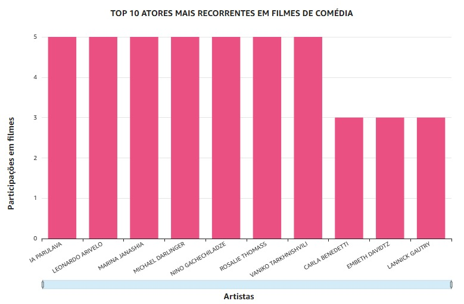
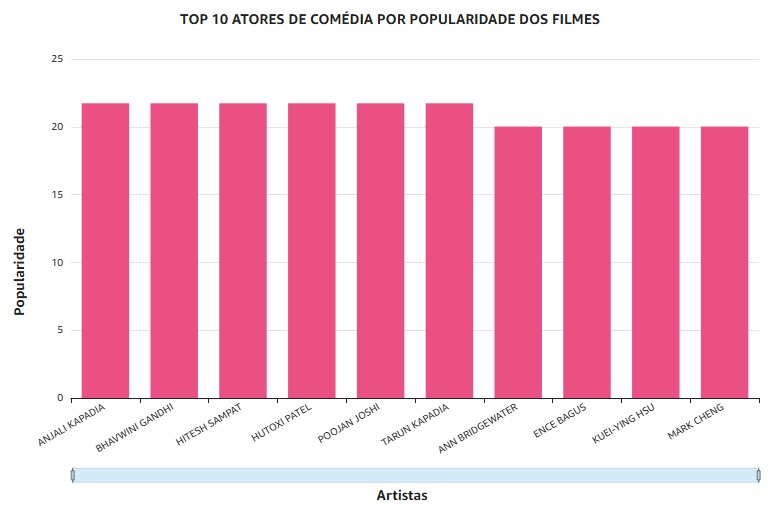
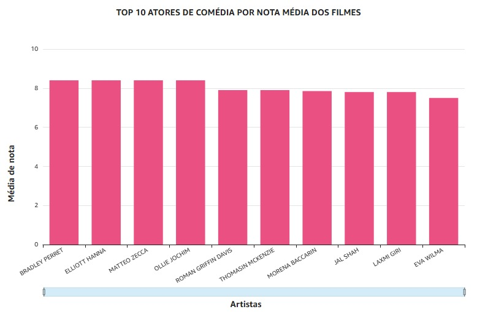
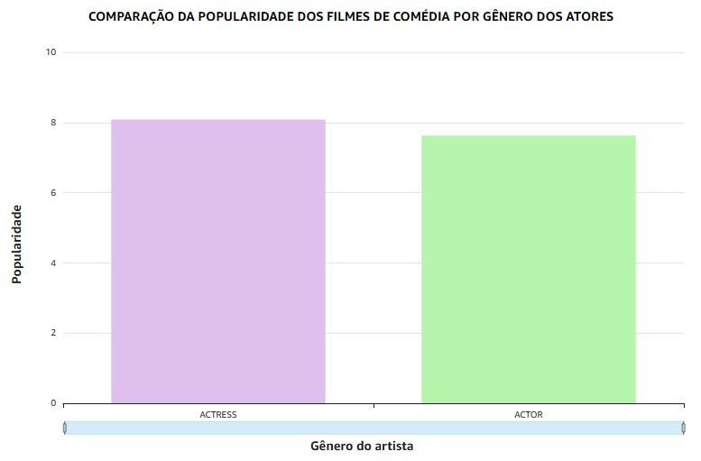
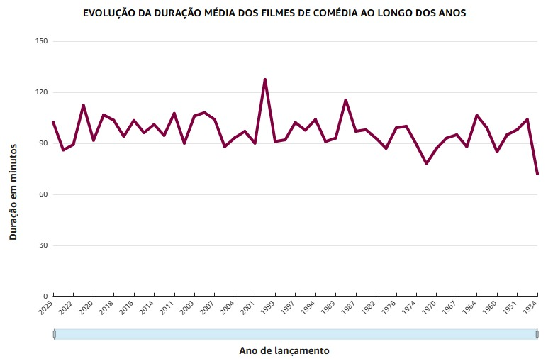
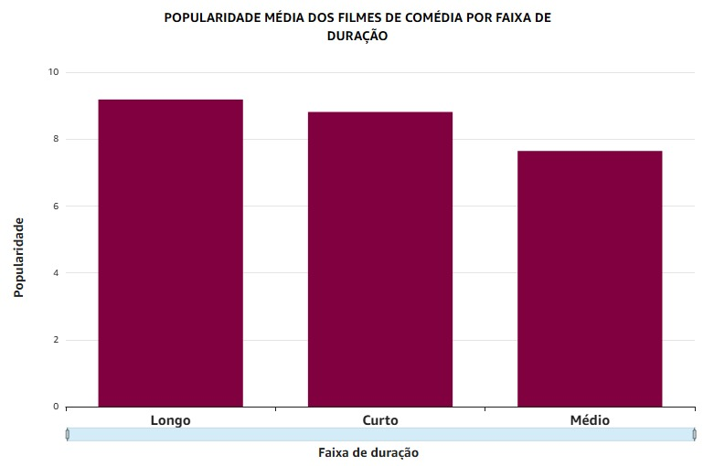

# DESAFIO

Iniciei a etapa final do Desafio conectando o QuickSight aos dados da minha camada Refined. Para isso, utilizei minhas tabelas já criadas no Athena na Sprint anterior. 

Como eu tinha uma tabela fato e três dimensões, precisei unir todas elas em uma consulta única, usando um SQL personalizado.

````
SELECT 
    f.id_avaliacao,
    f.nota_media,
    f.numero_votos,
    f.popularidade,
    a.nome_artista,
    a.genero_artista,
    a.profissao_artista,
    fl.titulo_principal,
    fl.duracao_minutos,
    t.ano_lancamento
FROM "glue-lab".tabela_fato22 f
JOIN "glue-lab".dim_artista22 a 
    ON f.id_artista = a.id_artista
JOIN "glue-lab".dim_filme22 fl 
    ON f.id_filme = fl.id_filme
JOIN "glue-lab".dim_tempo22 t 
    ON f.id_tempo = t.id_tempo
````


Além disso, antes de começar a criação dos dashboards, revisitei as minhas questões de análise e reformulei algumas delas para gerar insights mais relevantes e efetivos.

Sendo assim, as análises que farei serão as seguintes:

1. Quais artistas têm maior impacto nos sucessos de comédia?

2. Há diferença significativa na popularidade dos filmes de comédia liderados por artistas masculinos versus femininos?

3. Os filmes de comédia estão ficando mais longos ou mais curtos, e isso afeta a popularidade ou avaliação deles?

4. Quais características dos filmes de comédia estão mais associadas ao sucesso (popularidade e nota)?

<br>

## ANÁLISES

### 1. Quais artistas têm maior impacto nos sucessos de comédia?

Para responder essa pergunta, optei por criar três gráficos distintos, cada um analisando um critério diferente de impacto. Meu objetivo era mostrar que "sucesso" pode ser visto de formas variadas, dependendo do que se deseja medir: presença, popularidade ou avaliação crítica.

O primeiro gráfico apresenta os 10 artistas com maior número de participações em filmes de comédia, destacando aqueles mais recorrentes no gênero.



O segundo gráfico traz os 10 artistas cujos filmes de comédia têm a maior média de popularidade, evidenciando quais atores e atrizes costumam estar associados a projetos de maior repercussão com o público.



O terceiro gráfico mostra os 10 artistas cujos filmes têm as maiores médias de nota, ou seja, aqueles cujas participações estão ligadas a filmes melhor avaliados por crítica ou pelo público.



A comparação entre as listas mostra que **não há artistas em comum entre elas**. Isso indica que o impacto dos artistas em comédias depende muito do critério adotado: **atuar em muitos filmes não significa, necessariamente, estar em produções mais populares ou melhor avaliadas**. Os dados sugerem que o sucesso em comédias está mais ligado à escolha dos projetos e à qualidade dos filmes do que apenas à frequência com que um artista aparece no gênero.

<br>

### 2. Há diferença significativa na popularidade dos filmes de comédia liderados por artistas masculinos versus femininos?

Para fazer essa análise, criei um gráfico de barras comparando a popularidade média dos filmes de comédia de acordo com o gênero dos artistas presentes no elenco. O gráfico considera apenas artistas classificados como “ACTOR” ou “ACTRESS” e mostra, para cada grupo de gênero, qual é a média de popularidade dos filmes em que participaram.

No eixo X do gráfico estão os gêneros (“ACTOR” para masculino e “ACTRESS” para feminino), e no eixo Y está a popularidade média desses filmes. Assim, consigo comparar rapidamente se há diferença de apelo de público entre filmes de comédia com presença de atores homens ou mulheres.



O resultado revela que a popularidade média dos filmes com a presença de atrizes é um pouco maior do que aquela dos filmes com atores. Embora a diferença não seja muito grande, o gráfico sugere que filmes de comédia em que atrizes estão no elenco tendem, em média, a ter maior engajamento do público.

A análise indica que **a participação de atrizes em filmes de comédia está associada, em média, a uma popularidade ligeiramente superior frente à participação de atores.**

<br>

### 3. Os filmes de comédia estão ficando mais longos ou mais curtos, e isso afeta a popularidade ou avaliação deles?

Para responder a essa questão, utilizei dois gráficos. O primeiro mostra que a duração média dos filmes de comédia permaneceu estável ao longo dos anos, normalmente entre 90 e 110 minutos, sem tendência clara de aumento ou diminuição significativa.



No segundo gráfico, agrupei os filmes de comédia em três 
faixas de duração:

- Curtos: filmes com até 90 minutos,

- Médios: filmes com 91 a 110 minutos,

- Longos: filmes com mais de 110 minutos.

<br>



Ao comparar a popularidade média de cada faixa, observei que os filmes mais longos (acima de 110 minutos) têm, em média, maior popularidade junto ao público, seguidos pelos curtos (até 90 minutos), enquanto os filmes de duração intermediária (91 a 110 minutos) apresentam a menor popularidade média entre os grupos. Apesar da diferença não ser muito grande, o gráfico sugere que filmes longos de comédia podem estar mais associados a sucessos de público do que os demais.

Sendo assim, a análise mostra que a duração dos filmes de comédia **se manteve estável ao longo do tempo, geralmente entre 90 e 110 minutos**. Quando agrupamos os filmes em faixas de duração — curtos (até 90 minutos), médios (91 a 110 minutos) e longos (mais de 110 minutos) — percebemos que **os filmes mais longos tendem a ter uma popularidade média um pouco maior do que os curtos ou médios.**

Isso sugere que comédias de maior duração podem estar mais associadas a projetos de maior apelo popular, embora a diferença não seja tão acentuada. Portanto, o sucesso de filmes de comédia parece depender pouco do tempo de duração, mas **filmes acima de 110 minutos apresentam, em média, uma vantagem em popularidade.**


### 4. Quais características dos filmes de comédia estão mais associadas ao sucesso?

Para descobrir quais características dos filmes de comédia estão mais associadas ao sucesso — medido por popularidade e nota média — relacionei indicadores de desempenho com atributos como duração e perfil do elenco. A análise mostra que não existe uma fórmula única para atingir altos índices de aprovação e engajamento, mas alguns padrões merecem destaque.

Em primeiro lugar, **comédias com duração mais longa (acima de 110 minutos) apresentam uma popularidade média superior em relação a filmes curtos ou intermediários.** Isso sugere que produções mais extensas podem se beneficiar de maior investimento, desenvolvimento de roteiro ou estratégias de divulgação que elevam seu apelo junto ao público.

Além disso, **filmes que contam com atrizes no elenco registram popularidade média ligeiramente maior do que aqueles com atores masculinos.** Embora a diferença não seja muito acentuada, o dado reforça o potencial de engajamento do público com elencos femininos em obras de comédia.

Por fim, ao comparar os rankings de recorrência, popularidade e nota dos artistas, **fica evidente que prevalência no gênero não garante participação nos filmes de maior destaque**. O sucesso parece depender mais da escolha precisa do elenco para cada projeto do que da simples repetição dos nomes mais frequentes.

Em síntese, **investir em comédias mais longas e dar protagonismo ao elenco feminino são ações que podem maximizar as chances de sucesso. Recomenda-se que decisões de casting e planejamento de produção levem em conta essas tendências identificadas na análise, combinando múltiplos fatores para potencializar o desempenho dos futuros lançamentos.**

O dashboard com todos os gráficos dessa análise pode ser visualizado aqui.