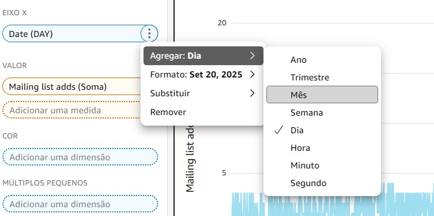

# LABORATÓRIO

Inicialmente, baixei o arquivo "web-and-social-analytics.csv.zip" solicitado para o laboratório e fiz upload no Amazon QuickSight.

Não constava na descrição do laboratório, porém precisei alterar o tipo dos dados antes de criar o gráfico. Alterei "Date" de texto para data e "Mailing list adds" para número inteiro.

Após isso, agrupei os dados por mês, conforme solicitado nas instruções.

Assim, obtive o resultado esperado para o laboratório.

Por fim, realizei a limpeza limpeza do que foi criado para não incorrer em custos desnecessários, conforme constava nas instruções.