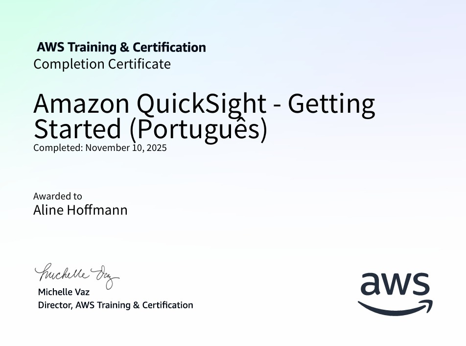

# 📍 **SPRINT 8**

## Complete Introduction to Amazon QuickSight

Nesse curso tive o meu primeiro contato com a ferramenta QhickSight e consegui entender bem como ela funciona na prática. Aprendi a criar tabelas, KPIs, filtros, controles, gráficos e dashboards, o que me ajudou bastante a visualizar e analisar dados de forma mais clara. Foi uma ótima introdução ao QuickSight e me deu uma boa base para aplicar esses conhecimentos na realização do desafio dessa sprint.

## Amazon QuickSight - Getting Started

Nesse segundo curso, pude reforçar e praticar ainda mais o que já tinha aprendido no curso anterior. Ele me ajudou a consolidar os conceitos sobre o QuickSight, entendendo melhor sua arquitetura, recursos e benefícios. Também aprofundei o uso prático da ferramenta, criando e explorando dashboards interativos a partir de diferentes fontes de dados. Foi importante para fixar o conteúdo e ganhar mais confiança no uso do QuickSight.

 

## **[EXERCÍCIOS (LABORATÓRIO)](https://github.com/aline-hoffmann/scholarship-compass/tree/main/Sprint_8/Exercicios)**

 

## **[CERTIFICADOS](https://github.com/aline-hoffmann/scholarship-compass/tree/main/Sprint_8/Certificados)**

### [Amazon QuickSight - Getting Started](https://github.com/aline-hoffmann/scholarship-compass/blob/main/Sprint_8/Certificados/certificado-aws-quicksight.pdf)

## **DESAFIO**

O desafio da Sprint 8 correspondeu à etapa dedicada ao consumo e análise dos dados presentes na camada Refined. Neste estágio, utilizei o Amazon QuickSight para realizar a exploração dos dados modelados, construindo gráficos que proporcionam uma visão agregada e estratégica sobre o conjunto de filmes, com foco especial em produções de comédia. O objetivo foi extrair e apresentar insights relevantes, evidenciando tendências, padrões e características marcantes do gênero.

Todos os passos, scripts e configurações utilizados no desafio podem ser visualizados [aqui.](https://github.com/aline-hoffmann/scholarship-compass/tree/main/Sprint_8/Desafio)